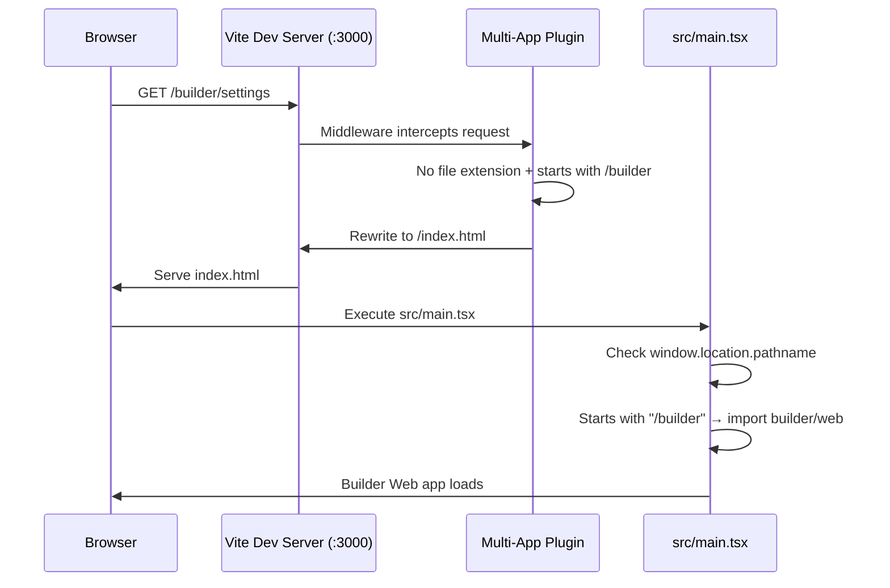
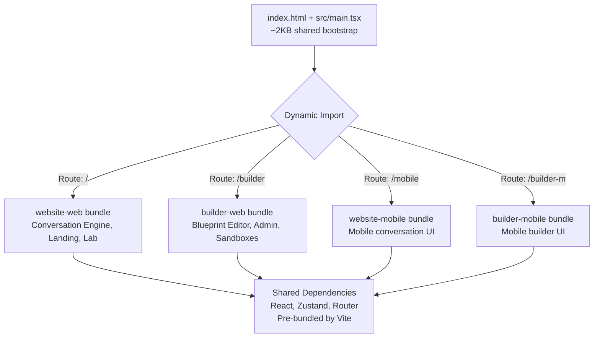
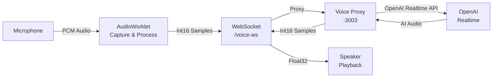
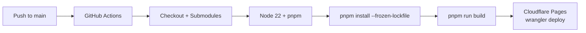

# Architecture

## Mental Model

Think of RAPP Design as a **shopping mall with one entrance**. Every visitor enters through the same front door (`index.html`), but a smart receptionist (`src/main.tsx`) looks at where you want to go (the URL) and directs you to the right store (app). Each store has its own layout and products, but they share the mall's infrastructure — electricity, plumbing, security (shared code, design system, state management).

---

## The Multi-App Monorepo

### What is a Monorepo?

A **monorepo** (mono = one, repo = repository) means all our code lives in a single Git repository. Instead of having 4 separate repos for 4 apps, we have one repo that contains everything. This makes it easy to:

- Share code between apps (no publishing packages)
- Make cross-app changes in a single commit
- Use one set of dependencies and one build configuration

### How Four Apps Share One Server

Most projects have one app per dev server. RAPP runs **four apps from a single Vite server** on port 3000. Here's how:



This is powered by two key files:

### 1. The Multi-App Plugin (`utils/multi-app-plugin.ts`)

This is a custom **Vite plugin** — a piece of code that hooks into Vite's request handling. Think of it as middleware that intercepts every HTTP request and decides what to do.

**What it does, step by step:**

1. **Builds a routing map** — Maps URL paths to app names:
   ```
   "/" or "/website" → website-web
   "/mobile"   → website-mobile
   "/builder"  → builder-web
   "/builder-m" → builder-mobile
   ```

2. **Intercepts requests** via middleware:
   - `/favicon.ico` → Serves the default app's favicon
   - `/lab/*.json` or `/archive/*.json` → Serves static JSON files directly
   - Any URL without a file extension (like `/builder/settings`) → Rewrites to `/index.html` (SPA fallback)
   - `/__apps__` → Dev helper that returns JSON listing all registered apps

3. **Resolves `@/` imports** — When a file does `import Foo from '@/components/Foo'`, the plugin figures out which app the import is in and resolves the path correctly:
   ```
   File in builder/web/src → @/ resolves to builder/web/src/
   File in website/web/src → @/ resolves to website/web/src/
   File in kf-design-system → @/ resolves based on builder-web aliases
   ```

4. **Lab API endpoints** — Dev-only REST endpoints for managing the component lab:
   - `POST /__lab-api/delete` — Delete lab options
   - `POST /__lab-api/archive` — Move options to archive
   - `POST /__lab-api/unarchive` — Restore archived options
   - `POST /__lab-api/archive-delete` — Delete from archive

### 2. The Dynamic Entry Point (`src/main.tsx`)

This is the JavaScript entry point that runs in the browser. It's elegant in its simplicity:

```typescript
const path = window.location.pathname

if (path.startsWith('/builder-m')) {
  // Set dark theme, mobile viewport, title
  import('../builder/mobile/src/main')
} else if (path.startsWith('/builder')) {
  // Set dark theme, title
  import('../builder/web/src/main')
} else if (path.startsWith('/mobile')) {
  // Set dark theme, mobile viewport, title
  import('../website/mobile/src/main')
} else {
  // Default: website web
  import('../website/web/src/main')
}
```

**Why this works:** Each `import()` is a **dynamic import** — the browser only downloads the JavaScript for the app you're actually visiting. If you go to `/builder`, you never download the website app's code. This is called **code splitting**.

**Before importing**, it sets per-app configuration:
- `data-theme` attribute (dark mode for builder and mobile)
- Viewport meta tag (mobile apps need touch-friendly viewports)
- Document title

---

## Code Splitting Strategy



**Key optimization:** Vite pre-bundles common dependencies (React, Zustand, React Router, Radix UI, etc.) upfront. This prevents a problem called "staggered dependency discovery" where Vite finds new dependencies during development and triggers multiple page reloads.

The `optimizeDeps.include` in `vite.config.ts` explicitly lists all shared dependencies:
```typescript
optimizeDeps: {
  include: [
    'react', 'react-dom', 'react-dom/client',
    'react/jsx-runtime', 'react/jsx-dev-runtime',
    'zustand', 'zustand/middleware',
    'react-router-dom', 'clsx', 'tailwind-merge',
    'lucide-react', '@tanstack/react-query', 'sonner',
    // ... Radix UI, builder-specific, website-specific
  ],
}
```

---

## Shared Code

### KF Design System (Git Submodule)

**What is a git submodule?** It's like a bookmark to another Git repository inside your repository. The `kf-design-system/` folder doesn't contain the actual files — it contains a pointer to a specific commit in the `OrangeScape/kf-design-system` repo. When you run `git submodule update`, Git downloads the files.

**Why a submodule?** The design system is shared across multiple projects, not just RAPP. Using a submodule means we always get the latest components without copy-pasting.

**How RAPP consumes it:**

The design system is connected via **path aliases** in `vite.config.ts`:

```typescript
resolve: {
  alias: {
    '@kfds-web': '/kf-design-system/packages/web/src/components',
    '@kfds-mobile': '/kf-design-system/packages/mobile/src/components',
  }
}
```

So when builder code does:
```typescript
import { Spinner } from '@kfds-web/spinner'
```
Vite resolves it to `kf-design-system/packages/web/src/components/spinner`.

**React version compatibility:** The design system was built for React 18, but RAPP uses React 19. The `package.json` uses pnpm overrides to force React 19:
```json
"pnpm": {
  "overrides": {
    "kf-icons>react": "^19.0.0",
    "kf-icons>react-dom": "^19.0.0"
  }
}
```

### Shared Web Utilities (`@rapp/shared-web`)

Located at `utils/shared-web/`, this package provides utilities used by multiple apps:
- **Auth utilities** — Login, session management
- **Spec utilities** — Manipulating app specifications
- **Shared hooks** — `useAuth` and others
- **Type definitions** — Shared TypeScript types

Accessed via the alias `@rapp/shared-web`.

### Theme Provider (`@rapp/providers`)

Located at `utils/providers/ThemeProvider.tsx`, provides dark/light theme support. Accessed via the alias `@rapp/providers`.

---

## State Management

RAPP uses **Zustand** for state management. If you're new to state management, think of it as the app's **memory** — where it stores information that needs to persist across page navigations and component re-renders.

### Why Zustand?

| Feature | Zustand | Redux | React Context |
|---------|---------|-------|--------------|
| Boilerplate | Minimal | Heavy | Medium |
| Learning curve | Low | High | Low |
| Performance | Excellent (selective re-renders) | Good (with selectors) | Poor (re-renders entire tree) |
| Persistence | Built-in middleware | External library | Manual |
| DevTools | Supported | Excellent | Limited |

### The Pattern

Every store follows this pattern:

```typescript
import { create } from 'zustand'
import { persist } from 'zustand/middleware'

const useAppStore = create(
  persist(
    (set, get) => ({
      // State
      apps: [],
      currentAppId: null,

      // Actions
      createApp: (prompt) => set(state => ({
        apps: [...state.apps, newApp(prompt)]
      })),

      // Selectors
      getCurrentApp: () => {
        const state = get()
        return state.apps.find(a => a.id === state.currentAppId)
      },
    }),
    { name: 'rapp-storage' } // localStorage key
  )
)
```

**The `persist` middleware** automatically saves state to `localStorage` and restores it when the page reloads. This means your conversation and app data survive browser refreshes.

### Store Map

```mermaid
graph TD
    subgraph "Builder Stores"
        BA[appStore<br/>Apps, specs, messages,<br/>conversation state]
        BAD[adminStore<br/>Users, roles, settings<br/>per-app instance]
        BAUTH[authStore<br/>Re-exports from shared-web]
    end

    subgraph "Website Stores"
        WA[appStore<br/>Apps, conversation flow,<br/>dynamic interview state]
        WL[labStore<br/>Gallery state, features]
        WAUTH[authStore<br/>Re-exports from shared-web]
    end

    subgraph "Shared"
        SA[@rapp/shared-web<br/>Auth utilities & hooks]
    end

    BAUTH --> SA
    WAUTH --> SA
```

---

## OpenAI Integration

RAPP uses OpenAI's GPT models for AI features:

| Model | ID | Used For |
|-------|-----|---------|
| Fast | `gpt-5.2-chat-latest` | Quick tasks — title generation, classification, simple analysis |
| Quality | `gpt-5.2` | Heavy tasks — code generation, detailed spec analysis |

**Development vs Production:**
- **Development:** Direct API calls to OpenAI (requires `VITE_OPENAI_API_KEY` in `.env`)
- **Production:** Calls go through a proxy at `/api/openai` (keeps API key secret)

**Static App Toggle:** The builder has a `USE_STATIC_APP = true` flag that returns a pre-built Leave Management app instead of calling the AI. Useful for development without an API key.

---

## Voice System

RAPP supports **voice conversations** — speak to the AI instead of typing.



**Components:**
1. **OpenAI Voice Proxy** (`openai-voice-proxy/`) — A Node.js WebSocket server that bridges between the browser and OpenAI's Realtime API
2. **Vite Proxy** — Routes `/voice-ws` requests to the proxy on port 3003
3. **useVoicePipe hook** — Browser-side hook handling mic capture, audio processing, silence detection, and playback

**Silence Detection:** The system detects when you stop talking by monitoring audio amplitude. If it drops below 0.06 for 1.5 seconds, it considers you done speaking.

---

## Build and Deployment

### Build Process

```bash
pnpm run build  # Runs: vite build && node postbuild.mjs
```

1. **Vite Build** — Compiles all TypeScript, bundles JavaScript, processes CSS, outputs to `dist/`
2. **Post-build** (`postbuild.mjs`) — Any post-processing steps

### Deployment Pipeline



**Key details:**
- Triggers on push to `main` branch only
- Uses a GitHub PAT (Personal Access Token) to access the private kf-design-system submodule
- Deploys to Cloudflare Pages using Wrangler CLI
- Branch deploys supported (preview URLs for PRs)

---

## Alias Reference

Quick reference for all import aliases:

| Alias | Resolves To | Used By |
|-------|------------|---------|
| `@kfds-web` | `kf-design-system/packages/web/src/components` | Builder Web |
| `@kfds-mobile` | `kf-design-system/packages/mobile/src/components` | Builder Mobile |
| `@rapp/shared-web` | `utils/shared-web` | All apps |
| `@rapp/providers` | `utils/providers/ThemeProvider.tsx` | All apps |
| `@/` | `{app}/src/` (context-dependent) | Per-app |
| `@/shared` | `kf-design-system/packages/web/src/shared` | Builder Web only |
