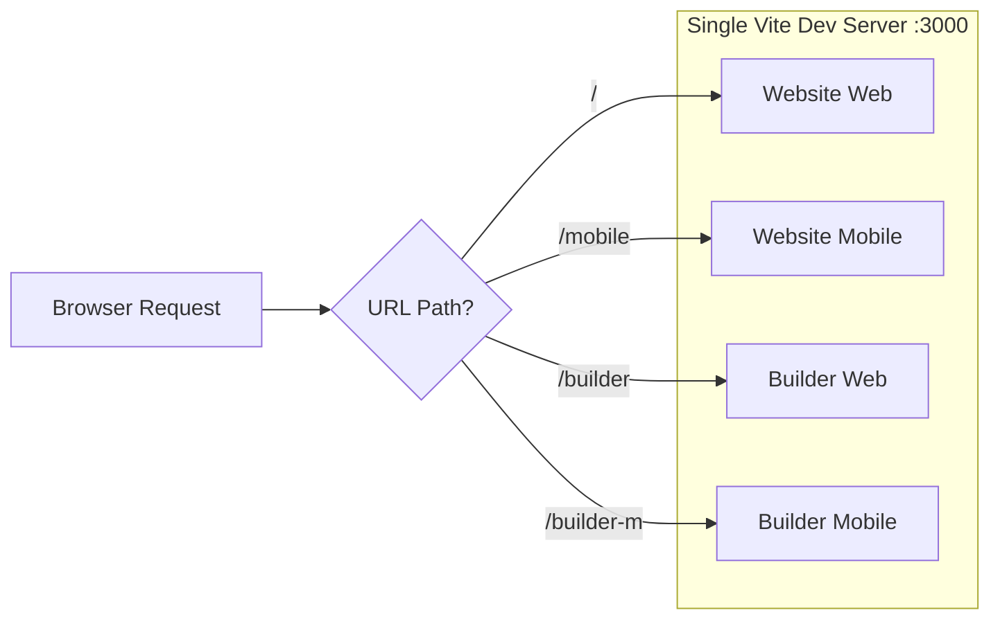

# RAPP Design

**An AI-powered app generation platform where you describe what you want to build, and AI builds it for you.**

---

## What is RAPP?

Imagine you want to build a business application — like a leave management system or an applicant tracking tool. Traditionally, you'd need to write code, design databases, and build user interfaces from scratch. RAPP changes that.

RAPP is a conversational platform where you **talk to an AI** (by typing or speaking), describe the app you want, and it generates a complete application for you. Think of it as having a senior developer who interviews you about your requirements and then builds the entire thing.

The platform has two main experiences:

1. **The Website** — Where users describe their app idea through a guided conversation. The AI asks smart questions, understands your needs, and generates a specification.
2. **The Builder** — Where developers can refine, edit, and manage the generated application using a visual editor with AI-powered tools.

---

## How It Works (The User Journey)

```
┌──────────────┐     ┌──────────────────┐     ┌─────────────────┐     ┌──────────────┐
│  Landing Page │────▶│  AI Conversation  │────▶│  Spec Generated │────▶│   Builder    │
│  "Build an    │     │  AI asks smart    │     │  Your app's     │     │  Edit, refine│
│   app idea"   │     │  questions about   │     │  blueprint is   │     │  and manage  │
│              │     │  your needs       │     │  ready          │     │  your app    │
└──────────────┘     └──────────────────┘     └─────────────────┘     └──────────────┘
```

---

## Project Structure

RAPP is a **monorepo** — a single repository that contains multiple applications. Think of it like an apartment building: one building (repository), but multiple apartments (apps) inside.

```
rapp-design/
├── src/main.tsx              # Front door — routes you to the right app
├── index.html                # Single HTML entry point for everything
├── vite.config.ts            # Build configuration (the construction blueprint)
├── package.json              # Dependencies and scripts
├── tsconfig.json             # TypeScript configuration
│
├── website/                  # 🌐 The Website (user-facing)
│   ├── web/src/              # Desktop website app
│   └── mobile/src/           # Mobile website app
│
├── builder/                  # 🔧 The Builder (developer tool)
│   ├── web/src/              # Desktop builder app
│   └── mobile/src/           # Mobile builder app
│
├── utils/                    # 🔗 Shared code
│   ├── multi-app-plugin.ts   # The magic that runs 4 apps from 1 server
│   ├── shared-web/           # Shared utilities (auth, spec helpers)
│   └── providers/            # Theme provider
│
├── kf-design-system/         # 🎨 UI component library (git submodule)
│
├── openai-voice-proxy/       # 🎤 Voice WebSocket server
│
└── functions/                # ☁️ Serverless middleware
```

### The Four Apps

All four apps run from a **single development server** on port 3000. The URL path determines which app loads:

| URL Path | App | Purpose |
|----------|-----|---------|
| `/` | website-web | Main conversational AI interface (desktop) |
| `/mobile` | website-mobile | Mobile version of the website |
| `/builder` | builder-web | App editor and management tool (desktop) |
| `/builder-m` | builder-mobile | Mobile version of the builder |



---

## Tech Stack

Here's what powers RAPP and why each technology was chosen:

| Technology | Version | What It Does | Why We Use It |
|-----------|---------|-------------|---------------|
| **React** | 19 | UI framework — builds the interactive interfaces | Industry standard, component-based, huge ecosystem |
| **TypeScript** | 5.7 | Typed JavaScript — catches bugs before runtime | Strict mode enabled for maximum safety |
| **Vite** | 7.3 | Dev server and bundler — makes development fast | Near-instant hot reload, optimized builds |
| **Tailwind CSS** | 4.0 | Utility-first CSS — style directly in HTML | Rapid styling, consistent design, small bundle |
| **Zustand** | 5.0 | State management — the app's "memory" | Simple API, built-in persistence to localStorage |
| **React Router** | 7.13 | Client-side routing — navigates between pages | Standard React routing solution |
| **Radix UI** | Various | Accessible UI primitives (dialogs, tooltips, etc.) | WCAG-compliant, unstyled (we control the look) |
| **pnpm** | 9.15 | Package manager — installs dependencies | Faster and more disk-efficient than npm |
| **Playwright** | 1.58 | End-to-end testing | Cross-browser testing support |

### What is pnpm?

pnpm is a package manager like npm or yarn, but faster and more efficient. Instead of copying packages into every project, it stores them once globally and creates links. This saves disk space and speeds up installations. RAPP **requires** pnpm — npm and yarn won't work.

---

## Prerequisites

Before you begin, make sure you have:

- **Node.js 20 or higher** — The JavaScript runtime ([download](https://nodejs.org))
- **pnpm 9.15 or higher** — The package manager
- **Git** — Version control (to clone the repo and manage submodules)

To install pnpm after installing Node.js:

```bash
corepack enable
corepack prepare pnpm@9.15.0 --activate
```

> **What is corepack?** It's a Node.js built-in tool that manages package manager versions. Running these commands enables pnpm at the correct version.

---

## Getting Started

### 1. Clone the repository

```bash
git clone https://github.com/OrangeScape/rapp-design.git
cd rapp-design
```

### 2. Initialize the design system submodule

The UI component library (`kf-design-system`) lives in a separate repository and is linked here as a **git submodule** — think of it as a "shortcut" to another repo that stays in sync.

```bash
git submodule update --init --recursive
```

### 3. Install dependencies

```bash
pnpm install
```

### 4. Set up environment variables

Create a `.env` file in the project root:

```bash
VITE_OPENAI_API_KEY=your-openai-api-key-here
```

> This key powers the AI features. Without it, the app falls back to static demo data.

### 5. Start the development server

```bash
pnpm dev
```

This starts a single server at `https://localhost:3000` (HTTPS with self-signed cert). Visit:
- `https://localhost:3000` — Website app
- `https://localhost:3000/builder` — Builder app

### 6. (Optional) Start the voice proxy

If you want voice features:

```bash
cd openai-voice-proxy
pnpm install
pnpm dev
```

This starts a WebSocket server on port 3003 that the main app proxies through `/voice-ws`.

---

## Available Scripts

| Command | What It Does |
|---------|-------------|
| `pnpm dev` | Start development server with hot reload |
| `pnpm build` | Build all apps for production |
| `pnpm lint` | Check code for style/quality issues |
| `pnpm lint:fix` | Automatically fix linting issues |
| `pnpm clean` | Remove node_modules and dist |

---

## Deployment

RAPP deploys automatically to **Cloudflare Pages** when code is pushed to the `main` branch. The GitHub Actions workflow:

1. Checks out code and initializes submodules
2. Sets up Node.js 22 and pnpm
3. Installs dependencies (`pnpm install --frozen-lockfile`)
4. Builds the project (`pnpm run build`)
5. Deploys to Cloudflare Pages

---

## Architecture Overview

```mermaid
graph TB
    subgraph "Browser"
        HTML[index.html] --> MainTSX[src/main.tsx]
        MainTSX -->|"URL = /"| WebsiteWeb[Website Web App]
        MainTSX -->|"URL = /builder"| BuilderWeb[Builder Web App]
        MainTSX -->|"URL = /mobile"| WebsiteMobile[Website Mobile App]
        MainTSX -->|"URL = /builder-m"| BuilderMobile[Builder Mobile App]
    end

    subgraph "Shared Layer"
        KFDS[KF Design System<br/>UI Components]
        SharedWeb[@rapp/shared-web<br/>Auth, Utilities]
        Theme[@rapp/providers<br/>Theme Provider]
    end

    subgraph "External Services"
        OpenAI[OpenAI API<br/>GPT-5.2]
        VoiceProxy[Voice Proxy<br/>WebSocket :3003]
        Cloudflare[Cloudflare Pages<br/>Hosting]
    end

    WebsiteWeb --> SharedWeb
    BuilderWeb --> KFDS
    BuilderWeb --> SharedWeb
    WebsiteWeb --> OpenAI
    BuilderWeb --> OpenAI
    WebsiteWeb --> VoiceProxy
```

---

## Next Steps

- **[ARCHITECTURE.md](./ARCHITECTURE.md)** — Deep dive into how the multi-app system works
- **[CONTRIBUTING.md](./CONTRIBUTING.md)** — How to set up your dev environment and contribute
- **[Tier 2: Builder App Guide](../tier-2/builder-app.md)** — Understanding the Builder application
- **[Tier 2: Website App Guide](../tier-2/website-app.md)** — Understanding the Website application
- **[Tier 3: Deep Dives](../tier-3/)** — Conversation engine, voice system, state management, and more
