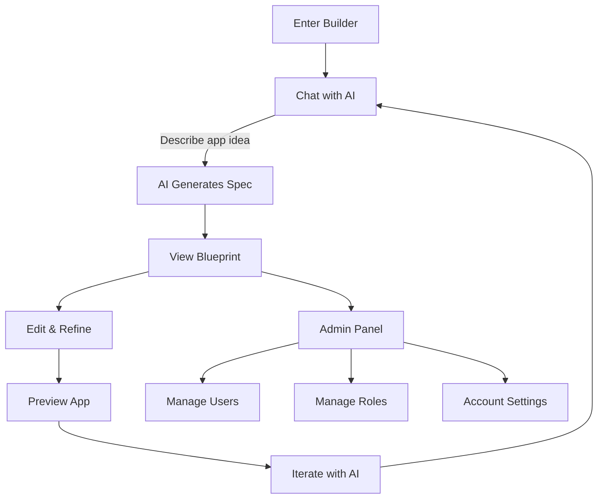
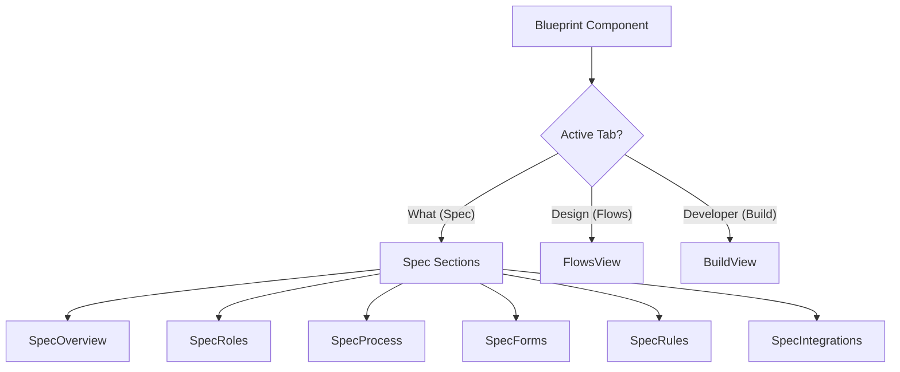
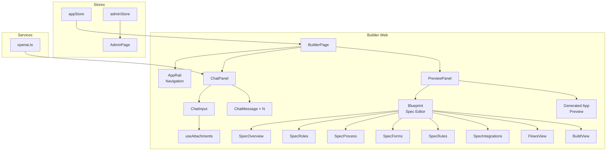

# Builder Application Guide

## What is the Builder?

The Builder is RAPP's **app editor** — think of it as an IDE (Integrated Development Environment) specifically designed for building business applications with AI assistance. If the Website app is where you describe your dream house, the Builder is where the blueprints get drawn, refined, and the house gets built.

The Builder has two versions:
- **Builder Web** (`/builder`) — Full desktop experience
- **Builder Mobile** (`/builder-m`) — Simplified mobile version

---

## User Journey

Here's what a typical session in the Builder looks like:



1. **Chat with AI** — Describe what you want to build in the chat interface
2. **AI generates a specification** — The AI creates a detailed app blueprint
3. **View the Blueprint** — See the complete spec: overview, roles, processes, forms, rules, integrations
4. **Edit & refine** — Modify the spec, ask AI to change things
5. **Preview** — See the generated app in the preview panel
6. **Admin panel** — Configure users, roles, and settings

---

## Core Components

### The Blueprint Editor

The Blueprint is the heart of the Builder. It's a visual representation of your app's complete specification, organized into tabs and sections.

**Location:** `builder/web/src/components/blueprint/`



**Three tabs:**

| Tab | Name | What It Shows |
|-----|------|--------------|
| `what` | Spec | The complete app specification — overview, roles, processes, forms, rules, integrations |
| `design` | Flows | Visual workflow diagrams showing how processes flow |
| `developer` | Build | The generated app code and technical details |

**Spec sections (in the "What" tab):**

- **SpecOverview** — High-level app description, purpose, key features
- **SpecRoles** — Who uses the app (Employee, Manager, HR Admin, etc.) with gallery grid and inspector views
- **SpecProcess** — Step-by-step workflows (e.g., "Submit Leave → Manager Approval → HR Processing") with a visual process workflow diagram
- **SpecForms** — Data forms the app needs (fields, types, validation) with gallery rows and inspector
- **SpecRules** — Business rules and logic (e.g., "Only managers can approve leaves over 5 days")
- **SpecIntegrations** — External system connections (email, Slack, databases)

Each section has:
- **Gallery view** — Browse items in a list or grid
- **Inspector panel** — Click an item to see and edit its details

### Chat Interface

The AI chat is how you communicate with the Builder. It's a sidebar (or floating panel) where you type instructions.

**Key components:**

| Component | File | Purpose |
|-----------|------|---------|
| `ChatInput` | `components/builder/ChatInput.tsx` | Text input with file attachment support |
| `ChatMessage` | `components/builder/ChatMessage.tsx` | Renders individual messages (user & AI) |
| `ChatPanel` | `components/builder/ChatPanel.tsx` | Full chat sidebar layout |
| `FloatingChat` | `components/builder/FloatingChat.tsx` | Floating chat bubble (minimizable) |
| `PreviewPanel` | `components/builder/PreviewPanel.tsx` | Shows the generated app preview |
| `RuntimeChatPanel` | `components/builder/RuntimeChatPanel.tsx` | Chat panel for runtime/admin context |

**How the chat works:**
1. User types a message or attaches files
2. Message is stored in `appStore` (Zustand)
3. The OpenAI service processes the message
4. AI response streams back and renders in the chat
5. If the AI generates/modifies a spec, the Blueprint updates

### Admin Panel

The Builder includes a full admin interface for managing the generated app's configuration.

**Routes:** Accessed at `/builder/runtimeadmin`

| Sub-route | Component | Purpose |
|-----------|-----------|---------|
| `/runtimeadmin/account` | `AccountSettings` | App-wide settings (name, timezone, branding, security) |
| `/runtimeadmin/users` | `UserManagement` | Add/remove users, manage access |
| `/runtimeadmin/roles` | `RoleManagement` | Define roles and permissions |

### Sandboxes

Sandboxes are **development playgrounds** — isolated pages for testing specific UI patterns and components. Think of them as "scratch pads" where developers experiment with new features before integrating them into the main app.

| Sandbox Route | Component | What It Tests |
|---------------|-----------|--------------|
| `/sandbox/logic-graph` | LogicGraphSandbox | Visual logic/workflow graphs |
| `/sandbox/assigned-to` | AssignedToSandbox | User assignment UI patterns |
| `/sandbox/input` | InputSandbox | Form input components and variants |
| `/sandbox/methods` | MethodsSandbox | Method/action configuration UI |
| `/sandbox/conditional` | ConditionalSandbox | Conditional logic builder |
| `/sandbox/conditional-radical` | ConditionalRadicalSandbox | Advanced conditional patterns |
| `/sandbox/insert` | InsertSandbox | Data insertion UI patterns |
| `/sandbox/setcontext` | SetContextSandbox | Context-setting UI patterns |

---

## State Management

The Builder uses three Zustand stores:

### appStore (`stores/appStore.ts`)

The main store — holds everything about the app being built:

```
appStore
├── Apps collection
│   ├── id, name, prompt
│   ├── spec (raw spec data)
│   ├── brdSpec (Business Requirements Document spec)
│   ├── generatedApp (generated web app code)
│   ├── generatedMobileApp (generated mobile app code)
│   ├── messages[] (chat history)
│   ├── conversationMessages[] (conversation flow)
│   ├── conversationStage (greeting → prompt → interview → summary → ready)
│   ├── interviewAnswers[] (responses to AI questions)
│   ├── suggestedRoles[] (AI-suggested user roles)
│   ├── uploadedFiles[] (attached documents)
│   └── businessEntities[] (extracted business objects)
├── currentAppId (which app is active)
└── Actions (createApp, setCurrentApp, setSpecData, setBrdSpec, etc.)
```

**Conversation stages:**
1. `greeting` — Initial welcome
2. `prompt` — User describes their app
3. `interview` — AI asks clarifying questions
4. `summary` — AI summarizes understanding
5. `ready` — Spec is complete, ready to build

### adminStore (`stores/adminStore.ts`)

Stores per-app admin configuration:
- Users and their roles
- Role definitions and permissions
- Account settings (timezone, branding, security)
- Instance management (if managing multiple app instances)

### authStore (`stores/authStore.ts`)

Re-exports authentication from `@rapp/shared-web` — login state, user info, session management. Shared across both Builder and Website apps.

---

## Services

### OpenAI Integration (`services/openai.ts`)

The Builder communicates with OpenAI's GPT models for AI-powered features:

- **Models:** `gpt-5.2-chat-latest` (fast tasks) and `gpt-5.2` (quality tasks like code generation)
- **API Key:** Set via `VITE_OPENAI_API_KEY` environment variable
- **Static Mode:** `USE_STATIC_APP = true` returns a pre-built Leave Management demo app — useful for development without an API key

---

## Key Hooks

| Hook | File | What It Does |
|------|------|-------------|
| `useVoicePipe` | `hooks/useVoicePipe.ts` | Bidirectional voice — speak to AI, hear AI respond. Connects via WebSocket to the voice proxy |
| `useSpecEditor` | `hooks/useSpecEditor.ts` | Blueprint editing logic — manages spec state, sections, updates |
| `useFormChat` | `hooks/useFormChat.ts` | Chat functionality for form-based conversations |
| `useAttachments` | `hooks/useAttachments.ts` | File upload handling — parse PDFs, Word docs, images. Extracts text content for AI processing |
| `useCrossTabSync` | `hooks/useCrossTabSync.ts` | Keeps multiple browser tabs in sync — if you edit in one tab, others update |

---

## Key Types

### app.ts — Core Application Types

```typescript
type ConversationStage = 'greeting' | 'prompt' | 'interview' | 'summary' | 'ready'
type ConversationPath = 'has_spec' | 'building' | 'exploring' | null
type InputMode = 'chat' | 'voice'

interface App {
  id: string
  name: string
  prompt: string
  spec: SpecData | null        // Parsed specification
  brdSpec: BRDSpec | null       // Business Requirements Document
  generatedApp: GeneratedApp | null
  messages: Message[]
  conversationStage: ConversationStage
  // ... more fields
}

interface Message {
  id: string
  role: 'user' | 'assistant' | 'system'
  content: string
  timestamp: Date
  attachments?: FileMetadata[]
}
```

### spec.ts — Blueprint/Specification Types

Defines the structure of a BRD (Business Requirements Document):
- `BRDSpec` — Top-level spec with all sections
- `ElementType` — Types of spec elements (role, process, form, rule, etc.)
- `SelectedElement` — Currently selected element in the inspector

### admin.ts — Admin Configuration Types

- `AdminUser` — User profile with role assignments
- `SecuritySettings` — Password policies, MFA settings
- `RoleAssignment` — Mapping users to roles

---

## Mobile Variant

Builder Mobile (`/builder-m`) is a simplified version:

**Differences from web:**
- Optimized for touch interaction
- Single-panel layout (no side-by-side chat + preview)
- Simplified component set (AttachmentChipTray, AttachmentPreviewSheet)
- Mobile-specific viewport configuration
- Dark theme by default

**Shared with web:**
- Same store structure (appStore)
- Same OpenAI service
- Same core types

---

## Component Relationship Diagram


