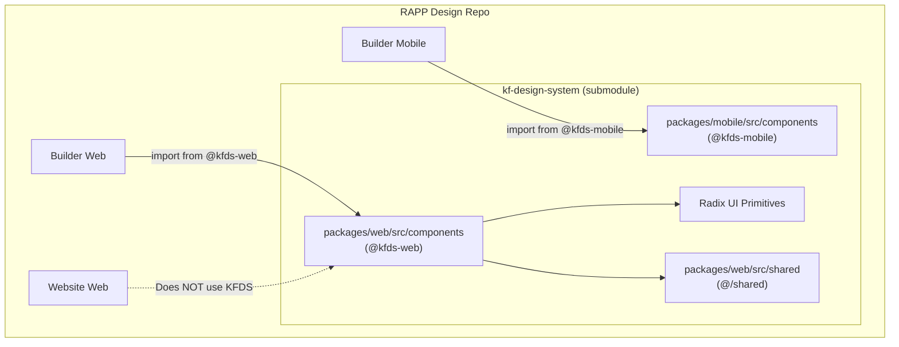

# KF Design System Guide

## What is a Design System?

A **design system** is a collection of reusable UI building blocks — buttons, dialogs, tooltips, spinners, input fields — that look and behave consistently across an entire application. Think of it like LEGO bricks: instead of carving each piece from scratch, you snap together pre-made pieces that all fit together perfectly.

Without a design system, every developer might build their own button with slightly different styles, padding, and behavior. A design system ensures every button looks and works the same way.

---

## What is KF Design System?

**kf-design-system** (KFDS) is the UI component library used by RAPP's Builder application. It's built on top of **Radix UI** — an open-source library of accessible, unstyled UI primitives.

**Key facts:**
- Built with React 18 (RAPP overrides to React 19)
- Based on Radix UI primitives (accessible by default)
- Provides styled components following Kissflow's design language
- Lives in a separate repository: `OrangeScape/kf-design-system`
- Connected to RAPP via a **git submodule**

---

## How It Connects to RAPP

### What is a Git Submodule?

A git submodule is like a **bookmark** inside your repository that points to a specific commit in another repository. The `kf-design-system/` folder in RAPP doesn't contain a copy of the code — it contains a pointer that says "go get commit X from this other repo."

```
rapp-design/
└── kf-design-system/     ← This is a submodule pointer
    └── (points to OrangeScape/kf-design-system @ commit 62ab6ee)
```

**Why a submodule (not a copy)?**
- The design system is shared across multiple Kissflow projects
- Updates to the design system propagate to all projects
- Each project pins to a specific commit (stability)
- You can update when ready by running `git submodule update --remote`

### Import Aliases

RAPP uses Vite aliases to make importing KFDS components clean:

```typescript
// In vite.config.ts
'@kfds-web': path.resolve(KF_DESIGN_SYSTEM_PATH, 'packages/web/src/components'),
'@kfds-mobile': path.resolve(KF_DESIGN_SYSTEM_PATH, 'packages/mobile/src/components'),
```

So instead of writing:
```typescript
// ❌ Ugly path
import { Spinner } from '../../../kf-design-system/packages/web/src/components/spinner'
```

You write:
```typescript
// ✅ Clean alias
import { Spinner, SPINNER_SIZE } from '@kfds-web/spinner'
```

### Additional Aliases

KFDS components internally use `@/shared` and `@/components` imports. The multi-app plugin resolves these for the builder-web context:

```typescript
// Builder-web specific alias
'@/shared': path.resolve(KF_DESIGN_SYSTEM_PATH, 'packages/web/src/shared'),
```

---

## Available Components

The design system provides two packages:

### Web Components (`@kfds-web`)

Used by **Builder Web**. Components built with Radix UI:

| Component | Import | Usage |
|-----------|--------|-------|
| Spinner | `@kfds-web/spinner` | Loading indicators — `<Spinner size={SPINNER_SIZE.LARGE} />` |
| Dialog | `@kfds-web/dialog` | Modal dialogs with overlay |
| Tooltip | `@kfds-web/tooltip` | Hover information tooltips |
| Dropdown Menu | `@kfds-web/dropdown-menu` | Context menus and dropdowns |
| Avatar | `@kfds-web/avatar` | User profile images with fallback |
| Switch | `@kfds-web/switch` | Toggle switches |
| Checkbox | `@kfds-web/checkbox` | Checkbox inputs |
| Slider | `@kfds-web/slider` | Range sliders |
| Toast | `@kfds-web/toast` | Notification toasts |
| Progress | `@kfds-web/progress` | Progress bars |
| Toggle Group | `@kfds-web/toggle-group` | Segmented controls |
| Popover | `@kfds-web/popover` | Floating content panels |
| Alert Dialog | `@kfds-web/alert-dialog` | Confirmation dialogs |
| Input Box | `@kfds-web/input-box` | Text input fields |
| List | `@kfds-web/list` | List components with selection |
| Select | `@kfds-web/select` | Dropdown select (built on Downshift) |

### Mobile Components (`@kfds-mobile`)

Used by **Builder Mobile**. Mobile-optimized versions of the same components.

---

## Theming

### How Theming Works

KFDS uses **CSS custom properties** (variables) for theming. These are defined in token files and can be overridden for different themes (light/dark).

**Token files in RAPP:**

```
builder/web/src/components/ui/theme/
├── globals.css          # Global theme styles
└── tokens/
    └── color.css        # Color token definitions
```

### Color Tokens

Colors are defined as CSS variables following a semantic naming convention:

```css
/* Example from color.css */
:root {
  --color-surface-50: #fafafa;
  --color-content-primary: #171717;
  --color-primary-500: #6366f1;
  /* ... */
}

[data-theme="dark"] {
  --color-surface-50: #1a1a1a;
  --color-content-primary: #fafafa;
  --color-primary-500: #818cf8;
}
```

**Naming convention:**
- `surface-*` — Background colors (50 = lightest, 900 = darkest)
- `content-*` — Text and icon colors (primary, secondary, tertiary)
- `primary-*` — Brand/accent colors
- `border-*` — Border colors

### Using Tokens in Components

Always use token classes instead of raw Tailwind colors:

```tsx
// ✅ Correct — uses design tokens
<div className="bg-surface-50 text-content-primary border-border-secondary">

// ❌ Wrong — hardcoded colors won't adapt to themes
<div className="bg-gray-100 text-gray-900 border-gray-300">
```

---

## How Builder and Website Consume KFDS

| App | Uses KFDS? | Import Alias | Components Used |
|-----|-----------|-------------|----------------|
| Builder Web | Yes | `@kfds-web` | Spinner, Dialog, Tooltip, Select, Input Box, etc. |
| Builder Mobile | Yes | `@kfds-mobile` | Mobile variants of same components |
| Website Web | No | — | Uses its own lightweight components |
| Website Mobile | No | — | Uses its own lightweight components |

**Why doesn't the Website use KFDS?** The Website has a different design aesthetic — it's consumer-facing with a conversational UI, while the Builder is a professional tool that follows Kissflow's established design language.

---

## React 18 → 19 Compatibility

KFDS was built for React 18, but RAPP uses React 19. This creates a potential version conflict.

**The solution:** pnpm overrides in `package.json`:

```json
{
  "pnpm": {
    "overrides": {
      "kf-icons>react": "^19.0.0",
      "kf-icons>react-dom": "^19.0.0"
    }
  }
}
```

And in `vite.config.ts`, React is forced to resolve from RAPP's node_modules:

```typescript
resolve: {
  dedupe: ['react', 'react-dom'],
  alias: {
    'react': path.resolve(__dirname, 'node_modules/react'),
    'react-dom': path.resolve(__dirname, 'node_modules/react-dom'),
  }
}
```

**What this does:**
1. `dedupe` tells Vite "only use one copy of React"
2. The alias ensures that copy is React 19 from RAPP's node_modules
3. pnpm overrides ensure sub-dependencies also use React 19

**Without this**, you'd get the dreaded "Invalid hook call" error — React hooks crash when two different React instances exist on the page.

---

## How to Use KFDS Components

### Basic Usage

```tsx
import { Spinner, SPINNER_SIZE } from '@kfds-web/spinner'

function LoadingState() {
  return (
    <div className="flex items-center gap-2">
      <Spinner size={SPINNER_SIZE.SMALL} />
      <span>Loading...</span>
    </div>
  )
}
```

### With Radix Patterns

Most KFDS components follow Radix UI's **compound component** pattern:

```tsx
import * as Dialog from '@kfds-web/dialog'

function MyModal({ open, onClose }) {
  return (
    <Dialog.Root open={open} onOpenChange={onClose}>
      <Dialog.Overlay />
      <Dialog.Content>
        <Dialog.Title>Confirm Action</Dialog.Title>
        <Dialog.Description>Are you sure?</Dialog.Description>
        <Dialog.Close>Cancel</Dialog.Close>
      </Dialog.Content>
    </Dialog.Root>
  )
}
```

---

## Updating the Design System

To pull the latest changes from the design system:

```bash
# From rapp-design root
git submodule update --remote kf-design-system
```

This updates the submodule pointer to the latest commit on `kf-design-system`'s main branch. Then commit the change:

```bash
git add kf-design-system
git commit -m "chore: update kf-design-system to latest"
```

---

## Architecture Diagram


