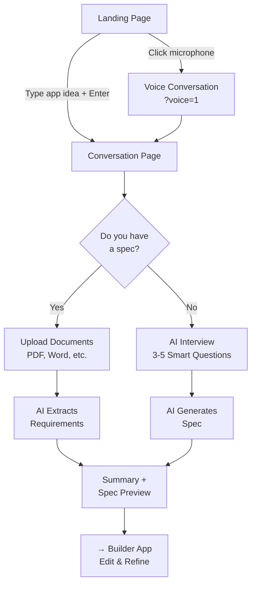
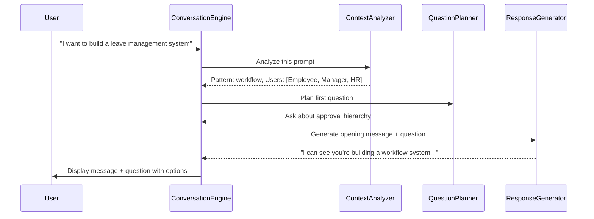
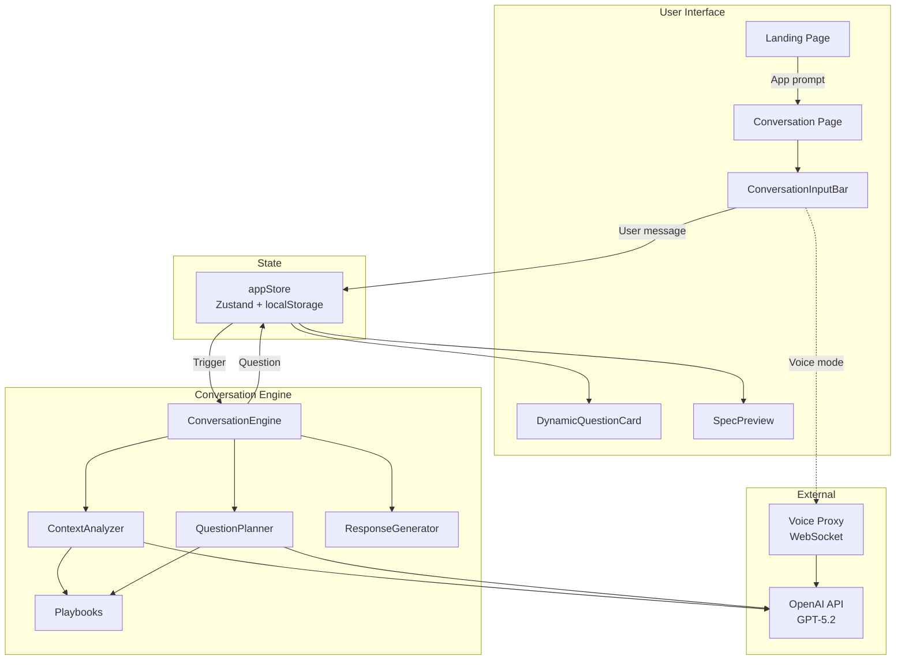

# Website Application Guide

## What is the Website App?

The Website app is RAPP's **front door** — it's the conversational AI interface where users describe the app they want to build. Think of it like walking into an architect's office: you explain what kind of house you want, the architect (AI) asks smart questions, and together you arrive at a detailed blueprint.

Two versions:
- **Website Web** (`/`) — Full desktop experience
- **Website Mobile** (`/mobile`) — Mobile-optimized version

---

## User Journey



### The Two Paths

When you start a conversation, the AI presents a choice:

**Path A — "I have a spec"**
1. Upload documents (PDF, Word, text)
2. AI reads and extracts requirements
3. Flags any gaps or ambiguities
4. Generates a complete specification
5. No interview questions needed

**Path B — "Build from scratch"**
1. AI analyzes your initial description
2. Asks 3-5 smart, targeted questions (not 20!)
3. Questions adapt based on your answers
4. AI infers ~80% of requirements from context
5. Generates a complete specification

---

## Conversation Engine (Overview)

The Conversation Engine is the AI brain behind the interview process. It lives in `website/web/src/conversation/engine/` and has four parts:

| Component | What It Does | Analogy |
|-----------|-------------|---------|
| **ConversationEngine** | Orchestrates the whole flow | The project manager |
| **ContextAnalyzer** | Understands what you're building | The analyst who reads between the lines |
| **QuestionPlanner** | Decides what to ask next | The interviewer who knows the right questions |
| **ResponseGenerator** | Crafts natural responses | The communicator who speaks clearly |



> **Deep dive:** See [Tier 3: Conversation Engine](../tier-3/conversation-engine.md) for the complete internal breakdown.

### Playbooks

Playbooks are **knowledge documents** that teach the AI how to have good conversations and understand app patterns. They live in `website/web/src/conversation/playbooks/`:

| Playbook | What It Teaches the AI |
|----------|----------------------|
| `conversation-rules.md` | How to conduct interviews (be concise, don't over-ask, infer 80%) |
| `good-conversations.md` | Example conversation flows that work well |
| `app-patterns.md` | Common app architecture patterns |
| `spec-requirements.md` | What a good spec needs to include |
| `workflow-apps.md` | How workflow/approval apps work |
| `data-apps.md` | How data collection apps work |
| `portal-apps.md` | How self-service portal apps work |

The AI loads these playbooks at runtime and uses them as context for making smart decisions about questions and responses.

---

## Components

### Conversation Components (`components/conversation/`)

| Component | Purpose |
|-----------|---------|
| `ConversationInputBar` | Main input — text field + voice toggle + file upload |
| `ChatMessage` | Renders a single message (supports markdown, code blocks) |
| `DynamicQuestionCard` | Displays AI questions with clickable option buttons |
| `ChoiceButtons` | "Do you have a spec?" choice UI |
| `SpecPreview` | Real-time preview of the generated specification |
| `UploadZone` | Drag-and-drop file upload area |
| `VoiceModeToggle` | Toggle between text and voice input |

### Landing Page (`components/landing/`)

The first page users see. Contains:
- App description input field
- Voice input option
- Example app ideas
- Navigation to start building

### Lab / Component Gallery (`components/lab/`)

A design exploration area where the team tests and showcases different UI options for features:

| Component | Purpose |
|-----------|---------|
| `LabGallery` | Browse all feature categories |
| `LabFeatureGallery` | View options within a feature |
| `LabOptionViewer` | Preview a specific design option (rendered in iframe) |

The Lab system supports:
- **Archiving** — Move explored options to archive (keeps things clean)
- **Unarchiving** — Restore archived options
- **Deletion** — Permanently remove options
- **Registry** — JSON-based tracking of all features and options

### Auth Components (`components/auth/`)

Login and signup views with social authentication support.

---

## Routes

| Route | Page | Purpose |
|-------|------|---------|
| `/` | Landing | Home page — enter your app idea |
| `/conversation` | ConversationPage | AI interview flow |
| `/lab` | Lab gallery | Browse feature design options |
| `/lab/:feature` | Feature view | Options for a specific feature |
| `/lab/:feature/:option` | Option detail | Preview a specific option |
| `/lab-preview/*` | Iframe preview | Renders lab options in isolation |
| `/lab/archive` | Archive gallery | Browse archived lab options |
| `/lab/archive/:feature` | Archived feature | Options in an archived feature |
| `/lab/archive/:feature/:option` | Archived option | Preview archived option |
| `/showcase` | ComponentShowcase | UI component gallery |

---

## State Management

### appStore (`stores/appStore.ts`)

The main store for the Website app:

```
appStore
├── Apps collection
│   ├── id, name, prompt
│   ├── conversationStage (greeting → prompt → has_spec → upload_spec → dynamic_interview → summary → ready)
│   ├── conversationPath ('has_spec' | 'building' | 'exploring')
│   ├── conversationMessages[] (full chat history)
│   ├── isConversationComplete (boolean)
│   ├── specHistory[] (versioned specs — VersionedSpec[])
│   ├── uploadedFiles[] (attached documents)
│   ├── dynamicInterview (AI interview state)
│   │   ├── questions[] (DynamicQuestion[])
│   │   ├── answers[] (DynamicAnswer[])
│   │   ├── currentIndex
│   │   ├── isComplete
│   │   └── complexityScore
│   └── refinementState (spec refinement progress)
├── currentAppId
├── inputMode ('chat' | 'voice')
├── isGenerating (AI working flag)
├── generationStatus / generationPhase / generationSubStatus
└── Actions
    ├── createApp, switchApp, deleteApp
    ├── addConversationMessage, updateLastMessage
    ├── setConversationStage, setConversationPath
    ├── initDynamicInterview, addDynamicQuestion, addDynamicAnswer
    └── setSpecData, addSpecVersion
```

### labStore (`stores/labStore.ts`)

Manages the Lab/Gallery system:
- Feature registries
- Active vs archived state
- Selection state for viewing options

### authStore

Re-exports from `@rapp/shared-web` — shared authentication across apps.

---

## Voice Features

The Website supports **voice conversations** — speak your app idea instead of typing.

**How it works:**
1. User clicks microphone on landing page (adds `?voice=1` to conversation URL)
2. `useVoicePipe` hook connects via WebSocket to the voice proxy
3. AI speaks questions aloud via OpenAI Realtime API
4. User speaks answers, silence detection triggers send
5. Transcribed text flows through the same conversation engine

**Key hooks:**

| Hook | Purpose |
|------|---------|
| `useVoicePipe` | Main bidirectional voice I/O — mic capture, playback, silence detection |
| `useRealtimeVoice` | Direct OpenAI Realtime WebSocket management |
| `useConversationFlow` | Orchestrates the conversation logic (works with both text and voice) |

> **Deep dive:** See [Tier 3: Voice System](../tier-3/voice-system.md)

---

## Mobile Variant

Website Mobile (`/mobile`) is optimized for phones:

**Differences from web:**
- Touch-friendly input bar with larger tap targets
- Simplified navigation (no lab, no showcase)
- Mobile-specific viewport (viewport-fit=cover, no user-scalable)
- Dark theme by default
- Conversation-focused single-page experience

**Shared with web:**
- Same conversation engine
- Same OpenAI service
- Same store structure
- Same voice capabilities

---

## Data Flow Diagram


