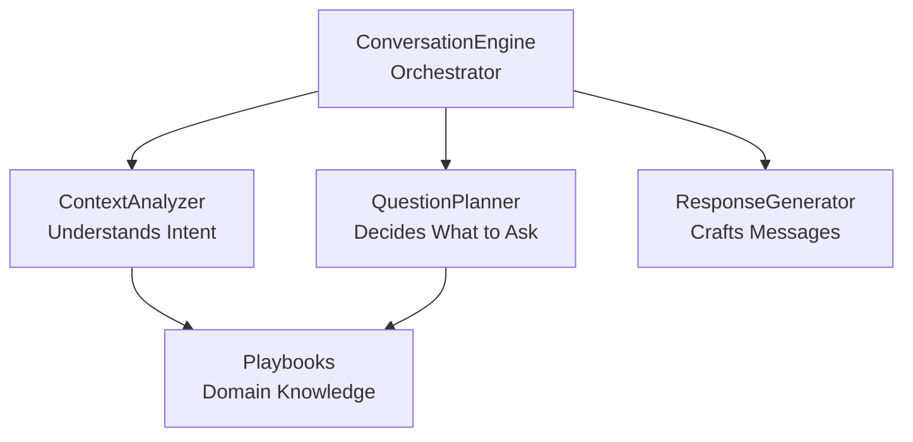
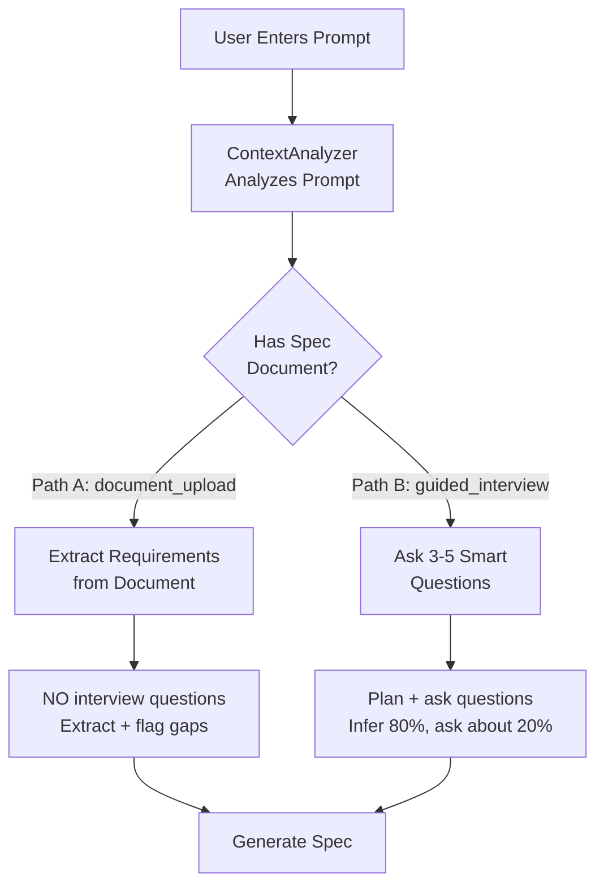
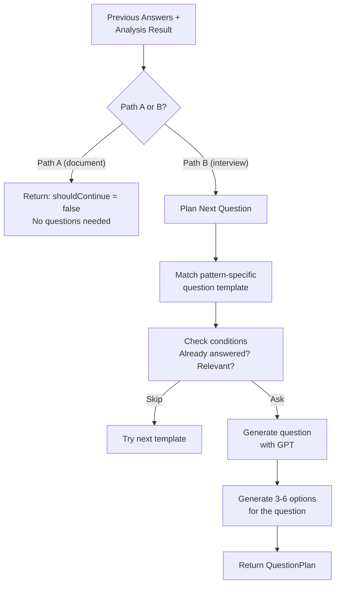
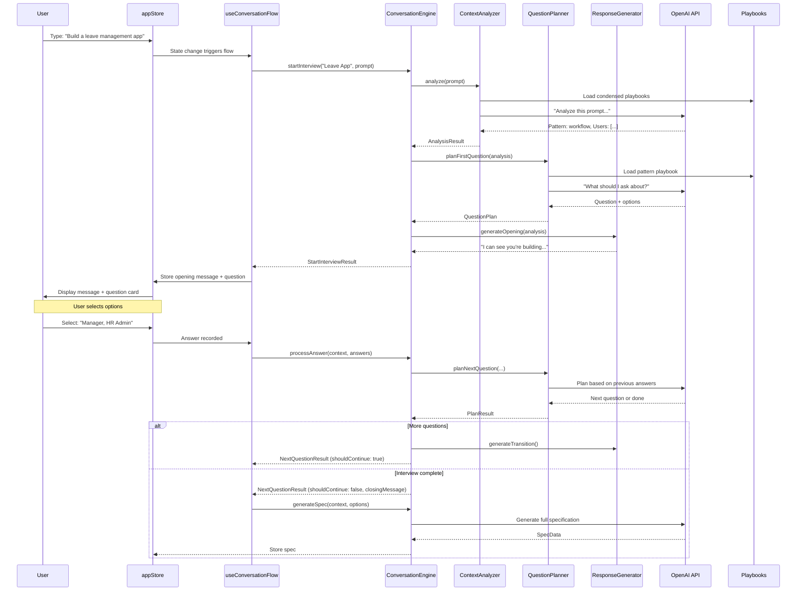
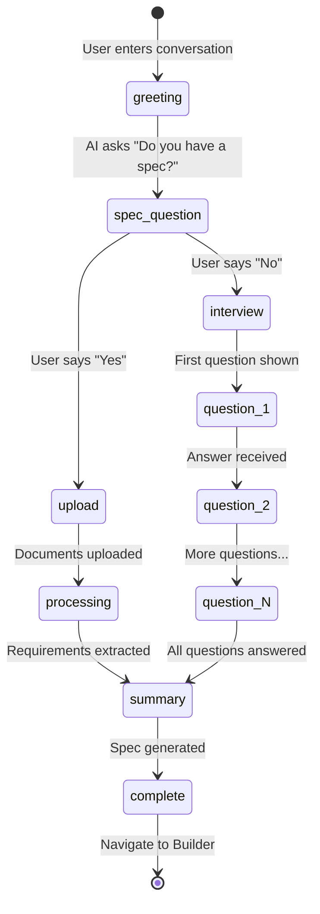

# Conversation Engine — Deep Dive

## What is the Conversation Engine?

Imagine you're hiring an architect to design your dream office building. A bad architect asks 50 questions and overwhelms you. A great architect listens to your initial idea, **infers 80% of what you need** from experience, and asks only 3-5 razor-sharp questions to fill in the gaps. That's exactly what the Conversation Engine does.

It's the AI system that powers the Website app's interview flow — analyzing what users want to build, deciding what questions to ask, and generating natural responses. It lives in `website/web/src/conversation/engine/`.

---

## The Four Components



| Component | File | Role | Analogy |
|-----------|------|------|---------|
| ConversationEngine | `ConversationEngine.ts` | Coordinates everything | Project manager |
| ContextAnalyzer | `ContextAnalyzer.ts` | Understands user intent | Business analyst |
| QuestionPlanner | `QuestionPlanner.ts` | Plans the interview | Expert interviewer |
| ResponseGenerator | `ResponseGenerator.ts` | Writes the messages | Communications lead |

---

## ConversationEngine — The Orchestrator

**File:** `website/web/src/conversation/engine/ConversationEngine.ts`

The main class that coordinates the entire conversation. It doesn't do analysis or question planning itself — it delegates to specialists.

### Key Interfaces

```typescript
interface StartInterviewResult {
  openingMessage: string           // First thing AI says
  firstQuestion: DynamicQuestion   // First interview question
  analysis: AnalysisResult         // What the analyzer found
  estimatedTotalQuestions: number   // How many questions expected (3-5)
  complexityScore: ComplexityScore // How complex is this app?
  conversationPath: ConversationPath // 'document_upload' or 'guided_interview'
}

interface NextQuestionResult {
  shouldContinue: boolean          // More questions needed?
  question: DynamicQuestion | null // Next question (if continuing)
  transitionMessage: string | null // "Great, that helps!" etc.
  estimatedRemaining: number       // Questions left
  closingMessage: string | null    // Final message when done
}
```

### Two Conversation Paths

The engine supports two mutually exclusive paths:



**Path A (Document Upload):** User has an existing spec document → AI extracts requirements directly, no questions needed.

**Path B (Guided Interview):** User has an idea but no document → AI asks 3-5 targeted questions, inferring most requirements from context.

### Usage Pattern

```typescript
const engine = new ConversationEngine()

// 1. Start interview
const start = await engine.startInterview(appName, userPrompt)
// Display: start.openingMessage + start.firstQuestion

// 2. After each answer, get next question
const next = await engine.processAnswer(context, previousAnswers)
if (next.shouldContinue) {
  // Display: next.transitionMessage + next.question
} else {
  // Display: next.closingMessage → proceed to spec generation
}

// 3. Generate the specification
const spec = await engine.generateSpec(context, options)
```

---

## ContextAnalyzer — Understanding Intent

**File:** `website/web/src/conversation/engine/ContextAnalyzer.ts`

When a user types "I want to build a leave management system," the ContextAnalyzer figures out:

### What It Detects

```typescript
interface AnalysisResult {
  conversationPath: ConversationPath  // 'document_upload' | 'guided_interview'

  // Pattern detection
  primaryPattern: AppPattern          // 'workflow' | 'portal' | 'data_collection' | 'tracking' | 'hybrid' | 'unknown'
  secondaryPattern?: AppPattern       // Secondary pattern if applicable
  patternConfidence: number           // 0-1 (how sure are we?)

  // Inferred from the prompt alone (before asking questions)
  inferredUsers: string[]             // ['Employee', 'Manager', 'HR Admin']
  inferredFeatures: string[]          // ['Leave request form', 'Approval workflow']
  inferredWorkflow: string | null     // 'Submit → Approve → Process'
  inferredIntegrations: string[]      // ['Email notifications', 'Calendar sync']

  // Domain context
  industry: string | null             // 'Human Resources'
  domain: string | null               // 'Leave Management'

  complexityScore: ComplexityScore    // { score: 1-5, ... }
}
```

### App Patterns

The analyzer classifies apps into patterns — this determines what questions to ask:

| Pattern | Description | Example |
|---------|-------------|---------|
| `workflow` | Approval/process flows | Leave management, expense reports |
| `portal` | Self-service access to information | Employee portal, customer dashboard |
| `data_collection` | Forms and data entry | Survey tool, registration system |
| `tracking` | Status tracking through stages | Bug tracker, order tracking |
| `hybrid` | Combines multiple patterns | Project management (tracking + workflow) |
| `unknown` | Can't determine pattern | Generic or novel apps |

### How It Works Internally

1. Sends the user's prompt to OpenAI with a system prompt that includes condensed playbooks
2. Asks GPT to identify the app pattern, infer users/features/workflow, and assess complexity
3. Parses the structured response into an `AnalysisResult`
4. The playbooks give GPT domain knowledge about how each app pattern typically works

---

## QuestionPlanner — Deciding What to Ask

**File:** `website/web/src/conversation/engine/QuestionPlanner.ts`

The QuestionPlanner is the "interview expert." Its job: ask the **minimum number of questions** to fill gaps in what the ContextAnalyzer already inferred.

### Hard Limits

```typescript
const ABSOLUTE_MAX_QUESTIONS = 6  // Never ask more than 6
const MIN_OPTIONS = 3             // Each question has at least 3 options
const MAX_OPTIONS = 6             // But no more than 6 options
```

### Pattern-Specific Question Templates

The planner has pre-defined question templates for each app pattern. For example, workflow apps get questions about:

```typescript
const PATTERN_QUESTIONS = {
  workflow: [
    { category: 'users', template: 'Who needs to be involved in the approval process?' },
    { category: 'features', template: 'What should happen after approval?' },
    // ...
  ],
  portal: [
    { category: 'users', template: 'What user segments need access?' },
    // ...
  ],
  // ...
}
```

### How It Plans



Each question is a `DynamicQuestion`:

```typescript
interface DynamicQuestion {
  id: string
  text: string                    // "Who needs to approve leave requests?"
  type: 'single' | 'multi'       // Single or multiple selection
  questionCategory: 'users' | 'features' | 'workflow' | 'integrations'
  options: Array<{
    id: string
    label: string                 // "Direct Manager"
  }>
}
```

---

## ResponseGenerator — Crafting Messages

**File:** `website/web/src/conversation/engine/ResponseGenerator.ts`

The ResponseGenerator makes the AI sound natural and conversational. It doesn't just dump questions — it creates context-aware messages with personality.

### Opening Templates

Different patterns get different opening messages:

```typescript
// Workflow pattern
"I can see you're building a workflow system. I've identified the basic approval
flow - let me ask a couple of questions to get the details right."

// Portal pattern
"A self-service portal - great choice! I've got the basics covered. Let me ask
about the specific access needs."

// Unknown pattern
"I want to make sure I understand your app correctly. Let me ask a few questions
to get the details right."
```

### Transition Phrases

Between questions, the AI uses natural transitions:
- "Great, that helps!"
- "Got it."
- "Perfect, moving on."
- "That makes sense."

These are selected randomly to avoid sounding robotic.

### Closing Messages

When the interview is complete, the AI summarizes and transitions to spec generation.

---

## Playbooks — Domain Knowledge

**Location:** `website/web/src/conversation/playbooks/`

Playbooks are markdown files that give the AI domain expertise. They're loaded at runtime and included in GPT prompts.

### conversation-rules.md
**The interviewing philosophy:**
- Ask maximum 3-5 questions (not 20)
- Infer 80% from context, ask about the remaining 20%
- Be concise — users want to build, not answer surveys
- Each question should be multiple-choice with smart defaults

### good-conversations.md
**Example conversation flows** that demonstrate the ideal interview pattern. Shows what good and bad conversations look like.

### app-patterns.md
**Common app architecture patterns:**
- What makes a workflow app vs a portal vs a data app
- Standard features for each pattern
- User role structures

### spec-requirements.md
**What a complete specification needs:**
- Required sections (overview, users, processes, forms, rules)
- Quality criteria for each section
- How to handle gaps and ambiguities

### workflow-apps.md, data-apps.md, portal-apps.md
**Pattern-specific deep dives:**
- Typical workflows and approval chains
- Common data structures
- Standard integrations
- Industry-specific considerations

---

## Complete Data Flow



---

## Conversation Stages

The conversation progresses through defined stages:



---

## Side Effects of Modification

If you're modifying the conversation engine, be aware:

| Change | Impact |
|--------|--------|
| Editing playbooks | Changes AI behavior for ALL future conversations |
| Modifying question templates | Affects which questions are asked per pattern |
| Changing ABSOLUTE_MAX_QUESTIONS | Directly controls interview length |
| Modifying ContextAnalyzer prompts | Changes how apps are classified |
| Changing conversation stages | Affects UI flow in ConversationPage |
