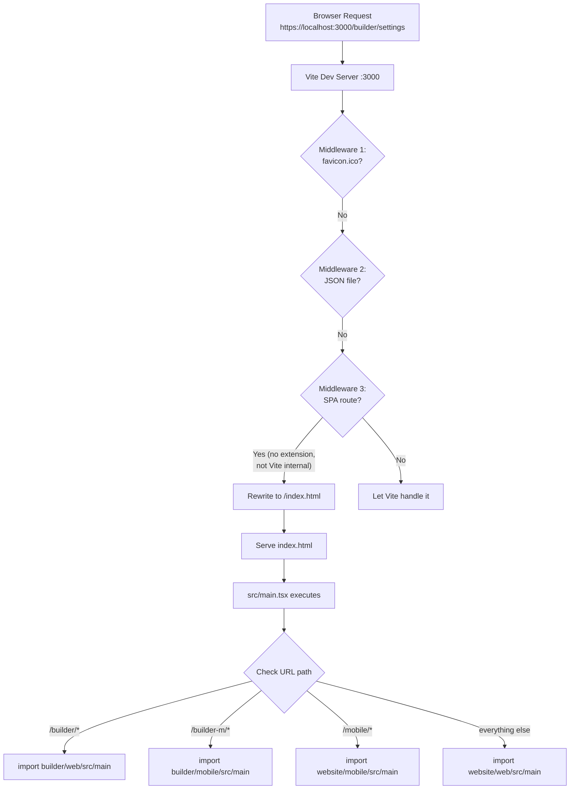
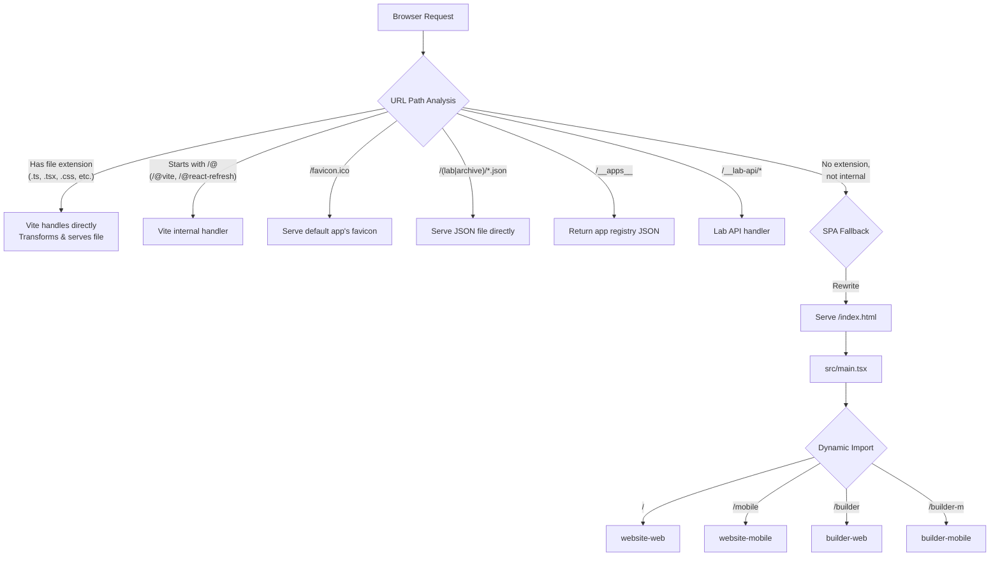

# Multi-App Plugin — Deep Dive

## What Problem Does This Solve?

RAPP has four separate applications (website-web, website-mobile, builder-web, builder-mobile). The naive approach would be four separate development servers, four separate build configurations, four separate deployment pipelines. That's a maintenance nightmare.

The multi-app plugin solves this by serving **all four apps from a single Vite development server**. One server, one port, one build command — but four completely independent apps. It's like having four apartments in one building, sharing the same plumbing and electricity.

---

## How It Works — The Big Picture



Two pieces work together:
1. **The Plugin** (`utils/multi-app-plugin.ts`) — Server-side: handles requests, resolves imports
2. **The Entry Point** (`src/main.tsx`) — Client-side: loads the right app based on URL

---

## The Plugin — Line by Line

### Configuration

```typescript
export interface AppConfig {
  root: string       // Directory where the app lives (e.g., 'website/web')
  paths: string[]    // URL paths that map to this app (e.g., ['/', '/website'])
}

export interface MultiAppPluginOptions {
  apps: Record<string, AppConfig>     // App registry
  defaultApp?: string                 // Fallback app (default: 'website-web')
  appAliases?: Record<string, Record<string, string>>  // Per-app import aliases
}
```

The plugin is registered in `vite.config.ts`:

```typescript
multiAppPlugin({
  apps: {
    'website-web':    { root: 'website/web',    paths: ['/', '/website'] },
    'website-mobile': { root: 'website/mobile', paths: ['/mobile'] },
    'builder-web':    { root: 'builder/web',    paths: ['/builder'] },
    'builder-mobile': { root: 'builder/mobile', paths: ['/builder-m'] },
  },
  defaultApp: 'website-web',
  appAliases: {
    'builder-web': {
      '@/shared': '/kf-design-system/packages/web/src/shared',
    },
  },
})
```

### Path-to-App Resolution

```typescript
// Build a lookup map: URL path → app name
const pathToApp = new Map<string, string>()
// Result: '/' → 'website-web', '/mobile' → 'website-mobile', etc.

function getAppFromPath(pathname: string): string | undefined {
  // 1. Exact match: '/builder' → 'builder-web'
  if (pathToApp.has(pathname)) return pathToApp.get(pathname)

  // 2. Prefix match: '/builder/settings' starts with '/builder' → 'builder-web'
  for (const [p, appName] of pathToApp) {
    if (p !== '/' && pathname.startsWith(`${p}/`)) return appName
  }

  // 3. Root: '/' → default app
  if (pathname === '/') return defaultApp

  // 4. SPA routes: '/conversation' (no extension, not Vite internal) → default app
  if (!pathname.includes('.') && !pathname.startsWith('/@') && !pathname.startsWith('/__')) {
    return defaultApp
  }

  return undefined
}
```

**Why the complexity?**
- `/builder` → exact match → builder-web
- `/builder/settings` → prefix match → builder-web
- `/conversation` → SPA fallback → website-web (default)
- `/src/main.tsx` → has extension → let Vite handle (it's a source file)
- `/@vite/client` → Vite internal → skip

### Middleware Stack

The plugin registers five middleware layers in the dev server:

#### 1. Favicon Handler

```typescript
server.middlewares.use((req, res, next) => {
  if (req.url === '/favicon.ico') {
    // Serve favicon from default app's public directory
    const faviconPath = resolve(root, apps[defaultApp].root, 'public', 'favicon.svg')
    if (fs.existsSync(faviconPath)) {
      res.setHeader('Content-Type', 'image/svg+xml')
      res.end(fs.readFileSync(faviconPath))
      return
    }
    res.statusCode = 204
    res.end()
    return
  }
  next()
})
```

Browsers always request `/favicon.ico`. Without this, you'd get 404 errors in the console.

#### 2. Static JSON Server

```typescript
// Serves lab/archive JSON files directly
if (pathname.match(/^\/(lab|archive)\/.*\.json$/)) {
  const filePath = resolve(root, 'website/web', pathname.slice(1))
  if (fs.existsSync(filePath)) {
    res.setHeader('Content-Type', 'application/json')
    res.end(fs.readFileSync(filePath, 'utf-8'))
    return
  }
}
```

The Lab feature stores design options as JSON files. This middleware serves them directly without going through Vite's transform pipeline.

#### 3. SPA Fallback

```typescript
// For non-file, non-Vite paths → serve index.html
if (!pathname.includes('.') && !pathname.startsWith('/@') && !pathname.startsWith('/__')) {
  // Skip app source paths too
  for (const appConfig of Object.values(apps)) {
    if (pathname.startsWith(`/${appConfig.root}/`)) return next()
  }
  req.url = `/index.html${queryString}`
  next()
}
```

**Why this matters:** In a Single Page Application (SPA), all routes are handled client-side by React Router. When you navigate to `/conversation`, the server doesn't have a `conversation.html` file — it needs to serve `index.html` and let React Router handle the route. This middleware does that.

#### 4. Dev Helper (`/__apps__`)

```typescript
if (req.url === '/__apps__') {
  res.setHeader('Content-Type', 'application/json')
  res.end(JSON.stringify(
    Object.entries(apps).map(([name, cfg]) => ({
      name, paths: cfg.paths, root: cfg.root,
    }))
  ))
}
```

Visit `https://localhost:3000/__apps__` to see a JSON list of all registered apps. Useful for debugging.

#### 5. Lab API Endpoints

Four REST endpoints for managing the component Lab (dev-only):

| Endpoint | Method | Purpose |
|----------|--------|---------|
| `/__lab-api/delete` | POST | Permanently delete lab options |
| `/__lab-api/archive` | POST | Move options to archive |
| `/__lab-api/unarchive` | POST | Restore from archive |
| `/__lab-api/archive-delete` | POST | Delete from archive |

These manipulate JSON registry files and option directories on disk.

### Import Resolution (`resolveId`)

This is the most complex part. When code does `import Foo from '@/components/Foo'`, Vite needs to know what actual file that refers to. The answer depends on **which app** the importing file belongs to.

```typescript
resolveId: {
  order: 'pre',  // Run BEFORE Vite's default resolver
  handler(source, importer) {
    if (!source.startsWith('@/') || !importer) return null

    // Step 1: Figure out which app the importer is in
    for (const [appName, appConfig] of Object.entries(apps)) {
      if (importer.includes(appConfig.root)) {
        // Step 2: Check for app-specific aliases
        const aliases = appAliases[appName] || {}
        for (const [prefix, aliasPath] of Object.entries(aliases)) {
          if (source.startsWith(prefix)) {
            // Resolve: @/shared/utils → kf-design-system/.../shared/utils
            return resolveWithExtensions(aliasPath, remainder)
          }
        }

        // Step 3: Default resolution → app's src/ directory
        // @/components/Foo → {app}/src/components/Foo
        return resolveWithExtensions(appConfig.root + '/src/', relativePath)
      }
    }
  }
}
```

**Special case: kf-design-system imports**

Components in the design system also use `@/` imports. These are resolved using builder-web's aliases:

```typescript
// If importer is inside kf-design-system/packages/web/src/components/
// → Use builder-web's alias configuration
if (importer.includes('kf-design-system/packages/web/src/components')) {
  const aliases = appAliases['builder-web'] || {}
  // ...resolve using builder-web context
}
```

**Extension resolution:** The resolver tries multiple extensions for each path:

```typescript
const extensions = ['.ts', '.tsx', '.js', '.jsx', '.mjs']
// Try: path.ts, path.tsx, path.js, path.jsx, path.mjs
// Then: path/index.ts, path/index.tsx, etc.
```

---

## The Entry Point (`src/main.tsx`)

The browser-side counterpart. After the plugin serves `index.html`, this script runs:

```typescript
const path = window.location.pathname

if (path.startsWith('/builder-m')) {
  document.documentElement.setAttribute('data-theme', 'dark')
  document.querySelector('meta[name="viewport"]')?.setAttribute(
    'content', 'width=device-width, initial-scale=1.0, viewport-fit=cover, user-scalable=no'
  )
  document.title = 'RAPP Builder Mobile'
  import('../builder/mobile/src/main')

} else if (path.startsWith('/builder')) {
  document.documentElement.setAttribute('data-theme', 'dark')
  document.title = 'RAPP Builder'
  import('../builder/web/src/main')

} else if (path.startsWith('/mobile')) {
  document.documentElement.setAttribute('data-theme', 'dark')
  document.querySelector('meta[name="viewport"]')?.setAttribute(
    'content', 'width=device-width, initial-scale=1.0, viewport-fit=cover, user-scalable=no'
  )
  document.title = 'RAPP Mobile'
  import('../website/mobile/src/main')

} else {
  document.title = 'RAPP - AI-Powered App Generation'
  import('../website/web/src/main')
}
```

**Order matters!** `/builder-m` must be checked before `/builder` because `/builder-m` starts with `/builder`. If the check was reversed, `/builder-m` would match the `/builder` condition.

**What each `import()` does:**
- Downloads the app's JavaScript bundle (code splitting)
- Executes the app's `main.tsx` which calls `ReactDOM.createRoot()` and renders the app
- Sets up that app's React Router, stores, and providers

---

## Dev Server vs Production

### Development (Vite Dev Server)

- Plugin middleware handles routing
- Dynamic imports trigger on-demand bundling
- HMR (Hot Module Replacement) works per-app
- `/__apps__` and `/__lab-api/*` endpoints available
- WebSocket proxy for voice (`/voice-ws`)

### Production (Built Output)

```bash
pnpm run build  # → vite build && node postbuild.mjs
```

- All apps compiled into a single `dist/` directory
- Code splitting produces separate chunks per app
- `index.html` + `src/main.tsx` handle routing client-side
- No middleware needed — hosting platform (Cloudflare Pages) serves `index.html` for all routes
- Lab API endpoints don't exist (dev-only)

```
dist/
├── index.html
├── assets/
│   ├── main-[hash].js          # Bootstrap (src/main.tsx)
│   ├── website-web-[hash].js   # Website web bundle
│   ├── builder-web-[hash].js   # Builder web bundle
│   ├── website-mobile-[hash].js
│   ├── builder-mobile-[hash].js
│   └── shared-[hash].js        # Shared dependencies
```

---

## How to Add a New App

### Step 1: Create the app directory

```
my-new-app/
├── src/
│   ├── main.tsx          # Entry point (ReactDOM.createRoot)
│   ├── App.tsx           # Root component
│   └── routes/index.tsx  # Router configuration
└── public/               # Static assets (optional)
```

### Step 2: Register in `vite.config.ts`

```typescript
const APPS = {
  // ... existing apps
  'my-new-app': {
    root: 'my-new-app',
    paths: ['/my-app'],
  },
}
```

### Step 3: Add to `src/main.tsx`

```typescript
// Add BEFORE the else clause
} else if (path.startsWith('/my-app')) {
  document.title = 'My New App'
  import('../my-new-app/src/main')
} else {
  // default app
}
```

### Step 4: (Optional) Add app-specific aliases

```typescript
appAliases: {
  'my-new-app': {
    '@/shared': path.resolve(__dirname, 'some/shared/path'),
  },
}
```

### Step 5: Test

Visit `https://localhost:3000/my-app` — your new app should load.

---

## Request Routing Diagram



---

## Side Effects of Modification

| Change | Impact |
|--------|--------|
| Changing app paths in APPS config | Breaks existing bookmarks and links |
| Modifying SPA fallback logic | May break client-side routing |
| Changing resolveId logic | Breaks `@/` imports (entire app crashes) |
| Adding new middleware | Runs for EVERY request — keep it fast |
| Removing `/__apps__` | Only affects dev convenience |
| Changing index.html serving | Breaks ALL apps (single entry point) |
| Order of conditions in main.tsx | Wrong app loads for matching prefixes |
