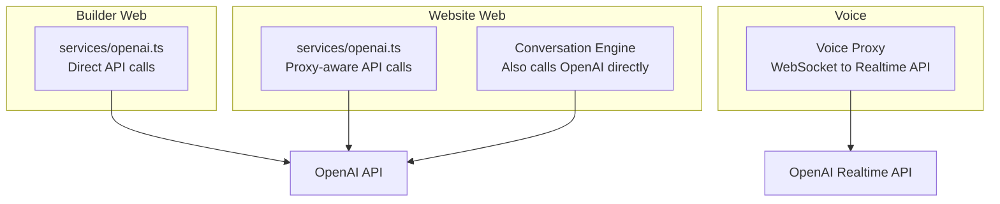
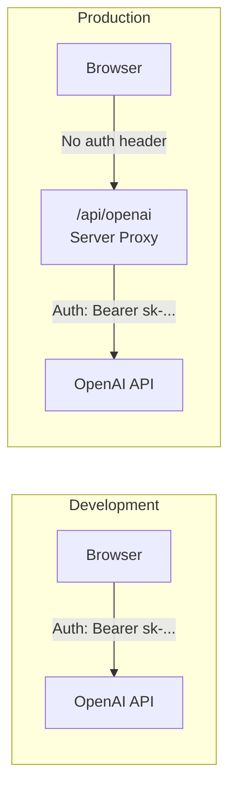
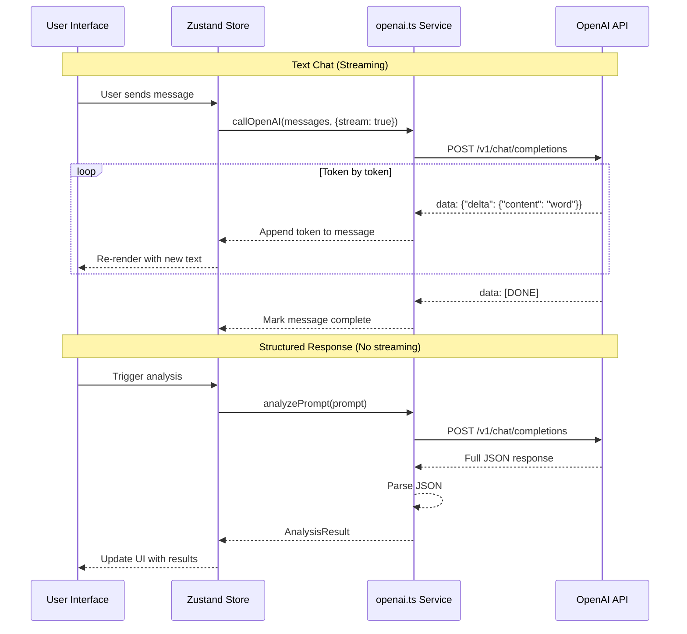

# OpenAI Integration — Deep Dive

## How AI Powers RAPP

AI is the core of RAPP — it's not a feature bolted on, it IS the product. Every major interaction is AI-powered:

| Feature | What AI Does |
|---------|-------------|
| App title generation | Extracts a clean name from user's description |
| Context analysis | Understands what kind of app the user wants |
| Dynamic questions | Generates smart interview questions |
| Spec generation | Creates complete app specifications |
| Code generation | Builds the actual application code |
| Voice conversations | Real-time speech-to-speech interaction |

---

## Two Integration Points

RAPP has two separate OpenAI service files — one for each app:



---

## Builder's OpenAI Service

**File:** `builder/web/src/services/openai.ts`

### Configuration

```typescript
// Toggle: set to true to use static demo app instead of AI
const USE_STATIC_APP = true

const API_KEY = import.meta.env.VITE_OPENAI_API_KEY
const API_ENDPOINT = 'https://api.openai.com/v1/chat/completions'

// Two models for different tasks
const MODEL_FAST = 'gpt-5.2-chat-latest'  // Quick tasks (classification, simple analysis)
const MODEL_QUALITY = 'gpt-5.2'            // Heavy tasks (code generation)
```

### The Static App Toggle

```typescript
const USE_STATIC_APP = true
```

When `true`, the builder returns a **pre-built Leave Management app** instead of calling the AI. This is incredibly useful for:

- **Development without an API key** — No need to set up OpenAI
- **UI development** — Work on the builder interface without waiting for AI
- **Demo purposes** — Always have a working example
- **Cost savings** — No API calls during development

The static app is defined in `mockdata/leave-management-app.ts`.

### API Call Pattern

```typescript
interface ChatMessage {
  role: 'system' | 'user' | 'assistant'
  content: string
}

async function callOpenAI(
  messages: ChatMessage[],
  options: {
    model?: string        // Default: MODEL_FAST
    maxTokens?: number    // Default: 2500
    stream?: boolean      // Default: false
  } = {}
): Promise<string> {
  const response = await fetch(API_ENDPOINT, {
    method: 'POST',
    headers: {
      'Content-Type': 'application/json',
      'Authorization': `Bearer ${API_KEY}`,
    },
    body: JSON.stringify({
      model,
      messages,
      max_completion_tokens: maxTokens,
      stream,
    }),
  })

  if (!response.ok) {
    throw new Error(`OpenAI API error: ${response.status}`)
  }
  // Parse and return response
}
```

### Key Functions

| Function | Model | Purpose |
|----------|-------|---------|
| App generation | `gpt-5.2` (quality) | Generates complete app code from spec |
| Chat responses | `gpt-5.2-chat-latest` (fast) | Responds to user messages in builder chat |
| Spec analysis | `gpt-5.2-chat-latest` (fast) | Analyzes and classifies specifications |

---

## Website's OpenAI Service

**File:** `website/web/src/services/openai.ts`

### Key Difference: Proxy Support

```typescript
// Development: direct API calls
// Production: goes through proxy (keeps API key secret)
const API_ENDPOINT = import.meta.env.PROD
  ? '/api/openai'                                    // Production proxy
  : 'https://api.openai.com/v1/chat/completions'     // Direct in dev

const getHeaders = (): Record<string, string> => {
  const headers = { 'Content-Type': 'application/json' }
  // Only include auth header in development
  if (!import.meta.env.PROD && OPENAI_API_KEY) {
    headers['Authorization'] = `Bearer ${OPENAI_API_KEY}`
  }
  return headers
}
```

**Why a proxy in production?**

In development, the API key lives in your `.env` file and is included in browser requests. This is fine locally but **dangerous in production** — anyone could open browser DevTools and steal the key.

The production proxy (`/api/openai`) is a server-side endpoint that:
1. Receives the request from the browser (no API key needed)
2. Adds the API key server-side
3. Forwards to OpenAI
4. Returns the response



### Fallback for Missing API Key

```typescript
export async function generateAppTitle(prompt: string): Promise<string> {
  if (!OPENAI_API_KEY) {
    if (import.meta.env.DEV) {
      console.warn('[OpenAI] API key not configured')
    }
    // Fallback: simple text extraction when no API key
    return extractTitleFromPrompt(prompt)
  }
  // ... normal AI call
}
```

Graceful degradation — if no API key is set, basic features still work with simple fallback logic.

### Key Functions

| Function | Purpose |
|----------|---------|
| `generateAppTitle` | Extracts clean app name from user prompt |
| `generateDynamicQuestion` | Creates interview questions (used by QuestionPlanner) |
| `generateSpecFromAnswers` | Builds spec from interview answers |
| `refineSpec` | Iterates on an existing spec |
| `analyzeDocument` | Extracts requirements from uploaded documents |

---

## Streaming Responses

### What is Streaming?

Normally, you send a request and wait for the ENTIRE response. With streaming, the response arrives **token by token** — the user sees text appear in real-time, like watching someone type.

```
Without streaming:
  [Send request] .......... [Entire response appears at once]

With streaming:
  [Send request] .I. .can. .see. .you're. .building. .a... (appears word by word)
```

### How Streaming Works

```typescript
// Request with stream: true
const response = await fetch(API_ENDPOINT, {
  body: JSON.stringify({
    model: 'gpt-5.2',
    messages: [...],
    stream: true,           // ← Enable streaming
  }),
})

// Response is a ReadableStream of Server-Sent Events (SSE)
const reader = response.body.getReader()
const decoder = new TextDecoder()

while (true) {
  const { done, value } = await reader.read()
  if (done) break

  const text = decoder.decode(value)
  // Each chunk looks like: data: {"choices":[{"delta":{"content":"Hello"}}]}
  // Parse and append to message
}
```

### Where Streaming is Used

| Feature | Streaming? | Why |
|---------|-----------|-----|
| Chat responses | Yes | User sees AI "typing" in real-time |
| Code generation | Yes | Long output — user sees progress |
| Title generation | No | Too short to benefit |
| Context analysis | No | Structured JSON response needed |
| Question planning | No | Structured response needed |

---

## Voice Integration with OpenAI Realtime API

The voice system uses a completely different API from the text-based features:

| | Chat Completions API | Realtime API |
|--|---------------------|-------------|
| **Protocol** | HTTP REST | WebSocket |
| **Input** | Text | Audio (PCM) or Text |
| **Output** | Text | Audio (PCM) + Text |
| **Model** | gpt-5.2 / gpt-5.2-chat-latest | gpt-4o-realtime-preview |
| **Latency** | Seconds | Milliseconds |
| **Connection** | Request/Response | Persistent bidirectional |

The Realtime API maintains an open WebSocket connection:
- Audio streams in both directions simultaneously
- The AI processes speech without a separate transcription step
- Responses are near-instantaneous

See [Voice System Deep Dive](./voice-system.md) for full details.

---

## Environment Variables

| Variable | Required | Where | Purpose |
|----------|---------|-------|---------|
| `VITE_OPENAI_API_KEY` | For AI features | `.env` (root) | OpenAI API key for development |
| `OPENAI_API_KEY` | For voice | `.env` (root) or env | Also read by voice proxy |
| `VOICE_PROXY_ALLOWED_ORIGINS` | No | Environment | Comma-separated allowed origins |

### Setting Up

```bash
# In project root, create .env
echo "VITE_OPENAI_API_KEY=sk-your-key-here" > .env
```

The `VITE_` prefix is important — Vite only exposes environment variables with this prefix to browser code. Without the prefix, the variable is only available server-side.

The voice proxy reads both `OPENAI_API_KEY` and `VITE_OPENAI_API_KEY` (fallback):
```typescript
const OPENAI_API_KEY = process.env.OPENAI_API_KEY || process.env.VITE_OPENAI_API_KEY
```

---

## Error Handling

```typescript
if (!response.ok) {
  const error = await response.json().catch(() => ({}))
  throw new Error(
    `OpenAI API error: ${response.status} - ${error.error?.message || 'Unknown error'}`
  )
}
```

Common errors:

| Status | Meaning | Solution |
|--------|---------|---------|
| 401 | Invalid API key | Check `VITE_OPENAI_API_KEY` in `.env` |
| 429 | Rate limited | Wait and retry, or upgrade OpenAI plan |
| 500 | OpenAI server error | Retry after a moment |
| Network error | Can't reach API | Check internet, check proxy config |

---

## Request/Response Flow Diagram



---

## Side Effects of Modification

| Change | Impact |
|--------|--------|
| Changing MODEL_FAST / MODEL_QUALITY | Affects response quality, speed, and cost |
| Setting USE_STATIC_APP = false | Builder will make real API calls (needs key) |
| Changing API_ENDPOINT | Breaks ALL AI features |
| Modifying system prompts | Changes AI behavior across the app |
| Adding/removing streaming | Affects UX (real-time typing vs waiting) |
| Changing max_completion_tokens | Limits response length (may truncate) |
