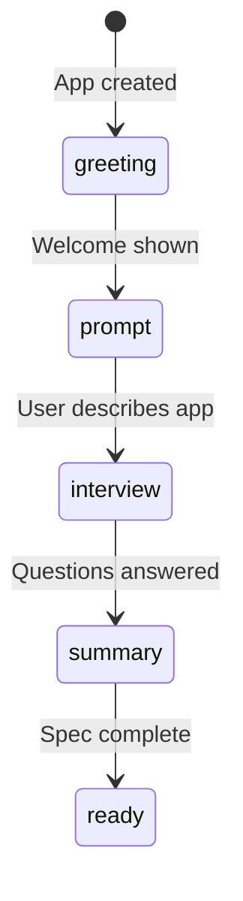
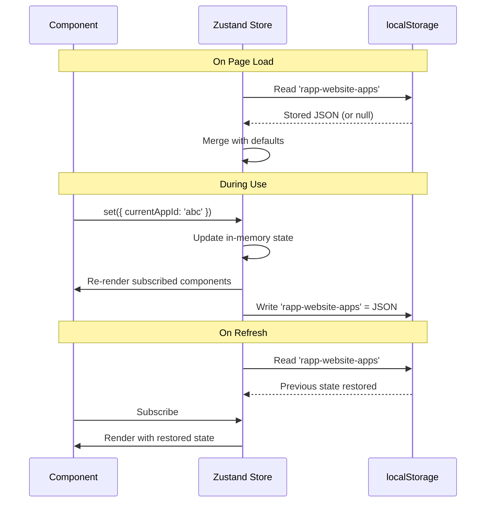
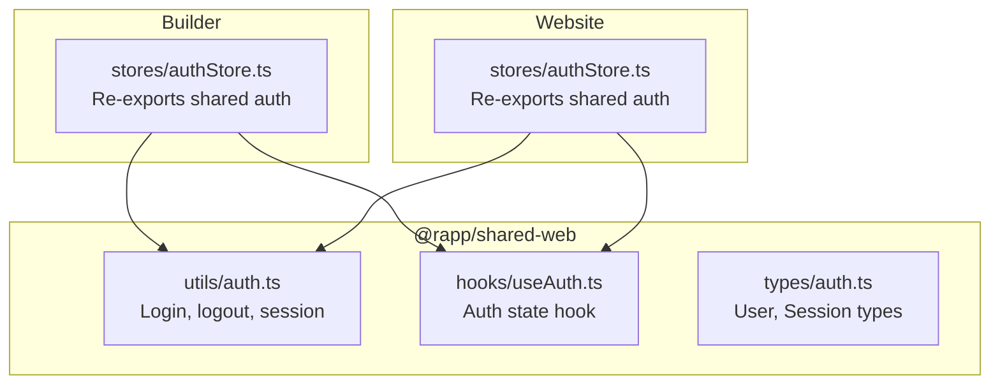

# State Management — Deep Dive

## What is State Management?

Every app needs a **memory** — a place to store information that different parts of the interface need to access. When you type a message in the chat, the message list component needs to know about it. When you switch apps in the builder, every panel needs to update. That shared memory is called "state."

**Without state management:** Each component stores its own data. Sharing data means passing it through 10 levels of parent-child components (called "prop drilling") — messy and fragile.

**With state management:** Data lives in a central store. Any component can read or update it directly.

---

## Why Zustand?

RAPP uses **Zustand** (German for "state"). Here's why it was chosen over alternatives:

| | Zustand | Redux | React Context |
|--|---------|-------|--------------|
| **Setup** | ~10 lines | ~50 lines + actions + reducers | ~30 lines |
| **Learning curve** | 30 minutes | Days | Hours |
| **Re-renders** | Only subscribed components | Only with selectors | Entire subtree |
| **Persistence** | Built-in `persist` middleware | Need redux-persist | Manual |
| **Bundle size** | 1.2 KB | 7.2 KB | 0 (built-in) |
| **DevTools** | Supported | Excellent | Limited |
| **TypeScript** | Excellent inference | Verbose generics | Good |

**The key advantage:** Zustand's selector pattern means components only re-render when the specific slice of state they use changes. React Context re-renders EVERYTHING under the provider when any value changes.

```typescript
// ✅ Zustand — only re-renders when `currentAppId` changes
const appId = useAppStore(state => state.currentAppId)

// ❌ Context — re-renders when ANY value in context changes
const { currentAppId } = useAppContext()
```

---

## The Zustand Pattern

Every store in RAPP follows this pattern:

```typescript
import { create } from 'zustand'
import { persist } from 'zustand/middleware'

const useMyStore = create(
  persist(
    (set, get) => ({
      // === STATE ===
      items: [],
      selectedId: null,

      // === ACTIONS (modify state) ===
      addItem: (item) => set(state => ({
        items: [...state.items, item]
      })),

      removeItem: (id) => set(state => ({
        items: state.items.filter(i => i.id !== id)
      })),

      // === SELECTORS (read computed state) ===
      getSelected: () => {
        const { items, selectedId } = get()
        return items.find(i => i.id === selectedId) || null
      },
    }),
    {
      name: 'my-storage',  // localStorage key
    }
  )
)
```

**Three parts:**
1. **State** — The data (plain objects, arrays, primitives)
2. **Actions** — Functions that modify state (always via `set()`)
3. **Selectors** — Functions that compute derived values (via `get()`)

**The `persist` middleware:**
- Automatically serializes state to `localStorage` on every change
- Restores state from `localStorage` when the app loads
- The `name` parameter is the `localStorage` key

---

## Builder Stores

### appStore — The Main Store

**File:** `builder/web/src/stores/appStore.ts`
**localStorage key:** `rapp-website-apps` (shared intentionally between Builder and Website apps)

This is the Builder's central nervous system. It manages everything about the apps being built.

```mermaid
graph TD
    subgraph "appStore"
        Apps[apps: App[]]
        Current[currentAppId: string]

        subgraph "Each App"
            Info[id, name, prompt]
            Spec[spec: SpecData<br/>brdSpec: BRDSpec]
            Gen[generatedApp<br/>generatedMobileApp]
            Conv[conversationStage<br/>conversationPath<br/>conversationMessages[]]
            Interview[interviewAnswers[]<br/>currentQuestionIndex<br/>autoAnswerMode]
            Files[uploadedFiles[]<br/>businessEntities[]]
            Roles[suggestedRoles[]]
        end

        Apps --> Info
        Apps --> Spec
        Apps --> Gen
        Apps --> Conv
        Apps --> Interview
        Apps --> Files
        Apps --> Roles
    end
```

#### State

| Field | Type | Purpose |
|-------|------|---------|
| `apps` | `App[]` | All apps created by the user |
| `currentAppId` | `string \| null` | Which app is currently active |

#### Each App Contains

| Field | Type | Purpose |
|-------|------|---------|
| `id` | `string` | UUID (generated with Safari fallback) |
| `name` | `string` | App name (e.g., "Leave Management") |
| `prompt` | `string` | Original user prompt |
| `spec` | `SpecData \| null` | Parsed specification data |
| `brdSpec` | `BRDSpec \| null` | Business Requirements Document |
| `generatedApp` | `GeneratedApp \| null` | Generated web app code |
| `generatedMobileApp` | `GeneratedApp \| null` | Generated mobile app code |
| `messages` | `Message[]` | Chat history with AI |
| `conversationMessages` | `Message[]` | Conversation flow messages |
| `conversationStage` | `ConversationStage` | Current stage (greeting → ready) |
| `conversationPath` | `ConversationPath` | has_spec \| building \| exploring |
| `interviewAnswers` | `InterviewAnswer[]` | Responses to AI questions |
| `currentQuestionIndex` | `number` | Which question we're on |
| `uploadedFiles` | `FileMetadata[]` | Attached documents |
| `businessEntities` | `BusinessEntity[]` | Extracted business objects |
| `suggestedRoles` | `Role[]` | AI-suggested user roles |

#### Conversation Stages



#### Key Actions

```typescript
// App CRUD
createApp(prompt: string, userId?: string): App
setCurrentApp(appId: string): void
updateApp(appId: string, updates: Partial<App>): void

// Conversation
setConversationStage(stage: ConversationStage): void
addMessage(message: Message): void

// Spec
setSpecData(spec: SpecData): void
setBrdSpec(brdSpec: BRDSpec): void

// Generation
setGeneratedApp(app: GeneratedApp): void
```

### adminStore — Per-App Administration

**File:** `builder/web/src/stores/adminStore.ts`

Manages admin configuration for each generated app:

```mermaid
graph TD
    subgraph "adminStore"
        Users[users: AdminUser[]]
        Roles[roles: RoleDefinition[]]
        Settings[accountSettings]

        subgraph "Account Settings"
            General[name, timezone, locale]
            Brand[logo, colors, theme]
            Security[password policy, MFA, session]
            Notifications[email, in-app settings]
        end

        Settings --> General
        Settings --> Brand
        Settings --> Security
        Settings --> Notifications
    end
```

This store is **per-app instance** — each app has its own set of users, roles, and settings.

### authStore — Shared Authentication

**File:** `builder/web/src/stores/authStore.ts`

Re-exports authentication state from `@rapp/shared-web`. This ensures both the Builder and Website apps share the same login session.

---

## Website Stores

### appStore — Conversation State

**File:** `website/web/src/stores/appStore.ts`

Similar to the Builder's appStore but focused on the conversation experience:

```mermaid
graph TD
    subgraph "Website appStore"
        Apps[apps: App[]]
        Current[currentAppId]
        UI[inputMode, isGenerating<br/>generationStatus, generationPhase]

        subgraph "Each App"
            Info[id, name, prompt]
            Conv[conversationStage<br/>conversationPath<br/>conversationMessages[]]
            DynInterview[dynamicInterview<br/>├── questions[]<br/>├── answers[]<br/>├── currentIndex<br/>├── isComplete<br/>└── complexityScore]
            Spec[specHistory: VersionedSpec[]<br/>refinementState]
            Files[uploadedFiles[]]
        end

        Apps --> Info
        Apps --> Conv
        Apps --> DynInterview
        Apps --> Spec
        Apps --> Files
    end
```

#### Unique to Website appStore

| Feature | Purpose |
|---------|---------|
| `dynamicInterview` | Tracks the AI interview state — questions, answers, completion |
| `specHistory` | Array of versioned specs (`VersionedSpec[]`) for iteration |
| `refinementState` | Track spec refinement progress (`RefinementState`) |
| `complexityScore` | AI-assessed app complexity (1-5) |
| `generationPhase` | Which phase of generation we're in |

#### Key Actions

```typescript
// Dynamic interview
initDynamicInterview(): void
addDynamicQuestion(question: DynamicQuestion): void
addDynamicAnswer(answer: DynamicAnswer): void

// Spec versioning
setSpecData(spec: SpecData): void
addSpecVersion(version: VersionedSpec): void

// Conversation flow
setConversationStage(stage: ConversationStage): void
addConversationMessage(message: Message): void
setConversationPath(path: 'has_spec' | 'building' | 'exploring'): void
resetConversation(): void
```

### labStore — Gallery State

**File:** `website/web/src/stores/labStore.ts`

Manages the Lab/Gallery feature:
- Feature registry (which features exist, their options)
- Active selections
- Archive state
- UI state (filters, views)

---

## Persistence — How localStorage Works



**What gets persisted:** Everything in the store by default. The `persist` middleware serializes the entire store to JSON.

**What doesn't persist well:**
- Functions (they're recreated)
- Date objects (serialized as strings — need manual handling)
- Circular references (JSON.stringify fails)

---

## Cross-Tab Sync

**Hook:** `builder/web/src/hooks/useCrossTabSync.ts`

When you have the Builder open in two browser tabs, changes in one tab should appear in the other. This hook uses the `storage` event to detect localStorage changes from other tabs:

```typescript
// Simplified concept
useEffect(() => {
  const handler = (event: StorageEvent) => {
    if (event.key === 'rapp-website-apps') {
      // Another tab updated the store
      // Zustand's persist middleware handles the merge
    }
  }
  window.addEventListener('storage', handler)
  return () => window.removeEventListener('storage', handler)
}, [])
```

**How it works:**
1. Tab A updates state → Zustand writes to localStorage
2. Browser fires `storage` event in ALL OTHER tabs
3. Tab B receives event → reloads state from localStorage
4. UI in Tab B updates

**Limitation:** Only fires in OTHER tabs, not the tab that made the change.

---

## Shared Authentication



Both apps re-export auth from the same source. This means:
- Login in one app = logged in everywhere
- Session management is unified
- User types are consistent

---

## Store Relationship Map

```mermaid
graph TB
    subgraph "Builder Stores"
        BA[appStore<br/>━━━━━━━━━━<br/>apps[], currentAppId<br/>specs, messages<br/>conversation state<br/>generated code]
        BAD[adminStore<br/>━━━━━━━━━━<br/>users[], roles[]<br/>account settings<br/>per-app instance]
        BAUTH[authStore]
    end

    subgraph "Website Stores"
        WA[appStore<br/>━━━━━━━━━━<br/>apps[], currentAppId<br/>conversation flow<br/>dynamic interview<br/>spec versions]
        WL[labStore<br/>━━━━━━━━━━<br/>feature registry<br/>active selections<br/>archive state]
        WAUTH[authStore]
    end

    subgraph "Shared"
        SA[@rapp/shared-web<br/>━━━━━━━━━━<br/>auth utils, hooks<br/>spec utilities]
    end

    subgraph "Persistence"
        LS[(localStorage)]
    end

    BAUTH -.-> SA
    WAUTH -.-> SA
    BA --> LS
    BAD --> LS
    WA --> LS
    WL --> LS
```

---

## Side Effects of Modification

| Change | Impact |
|--------|--------|
| Changing localStorage key name | Users lose ALL saved state (apps, conversations, settings) |
| Adding non-serializable state | `persist` middleware will fail silently |
| Removing a state field | Existing localStorage data will have orphaned keys |
| Adding a required state field | Existing users won't have it — need a default value |
| Changing store structure | May break cross-tab sync if tabs have different versions |
