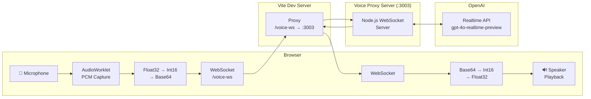
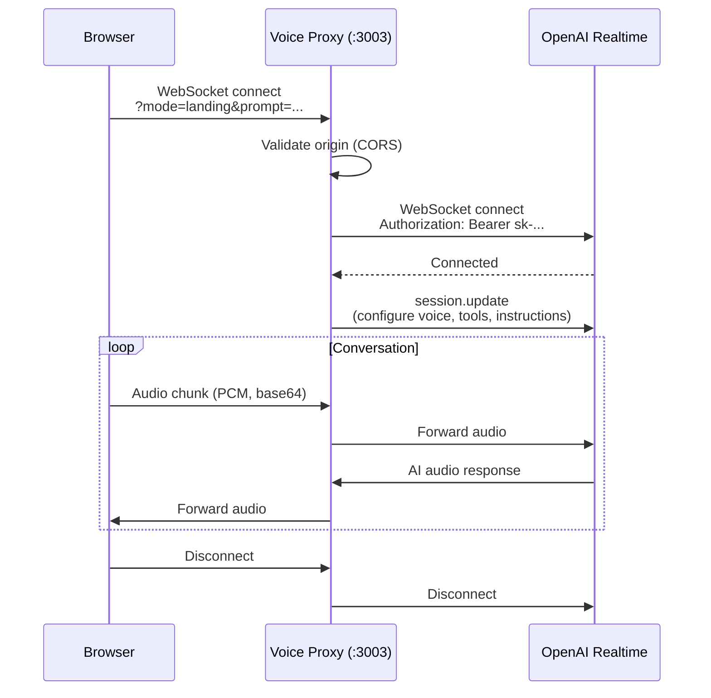
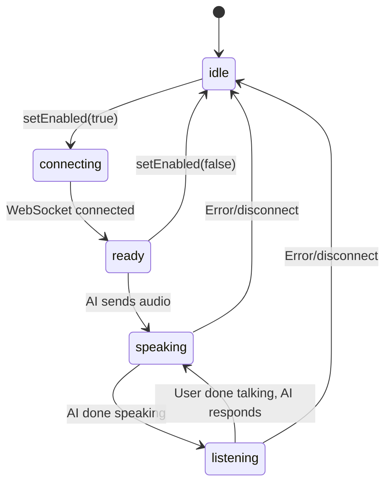
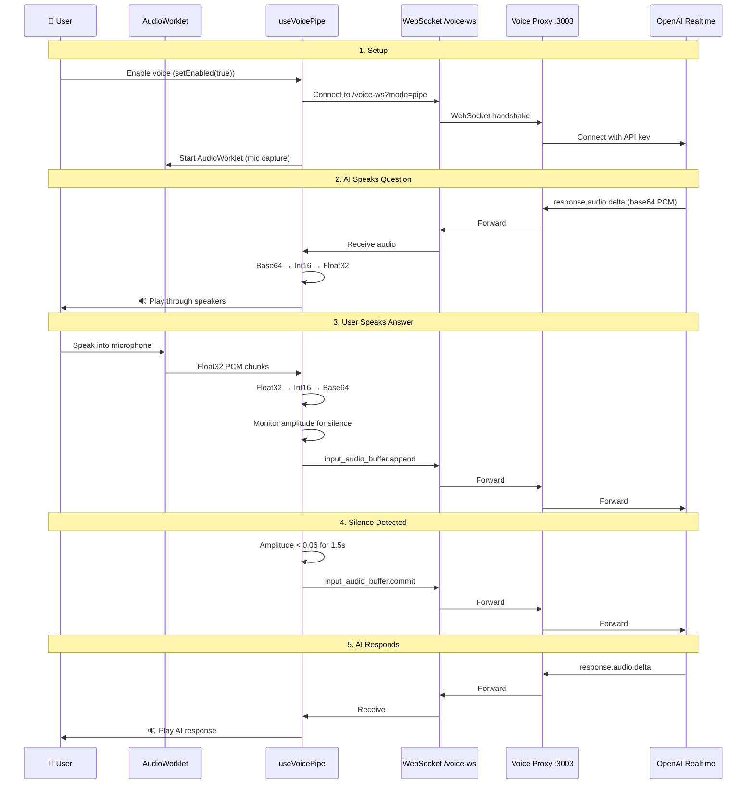

# Voice System — Deep Dive

## What is the Voice System?

Instead of typing "I want to build a leave management app," you can **say it out loud**. The AI hears you, processes your speech, responds with its own voice, and the conversation flows naturally — like talking to a real person.

The voice system is a bidirectional audio pipeline: your microphone captures speech, it gets sent to OpenAI's Realtime API, and the AI's voice response plays through your speakers.

---

## Architecture Overview



**Four layers:**
1. **Browser** — Captures mic audio, plays AI audio
2. **Vite Proxy** — Routes `/voice-ws` WebSocket to the voice proxy
3. **Voice Proxy** — Node.js server that bridges browser ↔ OpenAI
4. **OpenAI Realtime API** — Processes speech and generates voice responses

---

## OpenAI Voice Proxy

**Location:** `openai-voice-proxy/src/index.ts`

A standalone Node.js WebSocket server that acts as a bridge between the browser and OpenAI's Realtime API. The browser can't connect to OpenAI directly because:

1. **API key security** — The key can't be exposed in browser JavaScript
2. **CORS restrictions** — OpenAI's WebSocket endpoint doesn't allow browser connections
3. **Session configuration** — The proxy sets up the AI's personality and behavior

### How It Works



### Key Code Walkthrough

```typescript
// 1. Server starts on port 3003
const wss = new WebSocketServer({ port: PORT })

// 2. Browser connects
wss.on('connection', (clientWs, req) => {
  // 3. Validate origin (security)
  const origin = req.headers.origin
  if (origin && !allowedOrigins.includes(origin)) {
    clientWs.close(1008, 'Unauthorized origin')
    return
  }

  // 4. Detect mode (landing page vs conversation vs pipe)
  const mode = url.searchParams.get('mode') ?? 'landing'
  const appPrompt = decodeURIComponent(url.searchParams.get('prompt') ?? '')

  // 5. Connect to OpenAI Realtime API
  const openaiWs = new WebSocket(OPENAI_REALTIME_URL, {
    headers: {
      'Authorization': `Bearer ${OPENAI_API_KEY}`,
      'OpenAI-Beta': 'realtime=v1',
    },
  })

  // 6. Configure session based on mode
  openaiWs.on('open', () => {
    const config = mode === 'pipe'
      ? getPipeSessionConfig()
      : getConversationSessionConfig(appPrompt)
    openaiWs.send(JSON.stringify({ type: 'session.update', session: config }))
  })

  // 7. Bridge messages between browser ↔ OpenAI
  clientWs.on('message', (data) => openaiWs.send(data))
  openaiWs.on('message', (data) => clientWs.send(data))
})
```

### Session Modes

The proxy supports different modes via the `?mode=` URL parameter:

| Mode | Purpose | Configuration |
|------|---------|--------------|
| `landing` | Voice chat from landing page | General conversation, app discovery |
| `conversation` | Guided interview | Interview-focused instructions |
| `pipe` | Bidirectional voice pipe | Used by `useVoicePipe` — pure voice I/O |

### Security

- **Origin validation** — Only allows connections from `http(s)://localhost:3000`, `http(s)://localhost:7000`, and `ws://localhost:3003`
- **API key isolation** — The OpenAI key lives server-side only
- **Configurable origins** — Set `VOICE_PROXY_ALLOWED_ORIGINS` env var

---

## useVoicePipe — The Browser Hook

**File:** `website/web/src/hooks/useVoicePipe.ts` (also `builder/web/src/hooks/useVoicePipe.ts`)

This React hook manages the entire browser-side voice experience: microphone capture, audio processing, WebSocket communication, silence detection, and playback.

### States

```typescript
type VoicePipeStatus = 'idle' | 'connecting' | 'ready' | 'speaking' | 'listening'
```



### Audio Processing Pipeline

The hook handles complex audio transformations:

#### 1. Microphone Capture (PCM Worklet)

The browser captures audio using an **AudioWorklet** — a low-level audio processing API that runs on a separate thread for real-time performance.

```typescript
// The worklet runs in a dedicated audio thread
// It captures raw PCM (Pulse Code Modulation) samples at 24kHz
const WORKLET_CODE = `
class PCMProcessor extends AudioWorkletProcessor {
  process(inputs) {
    // inputs[0][0] is a Float32Array of audio samples
    // Post each chunk to the main thread
    this.port.postMessage(inputs[0][0])
    return true
  }
}
`
```

**What is PCM?** Pulse Code Modulation is raw audio data — just numbers representing sound wave amplitude at each point in time. No compression, no encoding. OpenAI's Realtime API expects PCM audio.

#### 2. Float32 → Int16 Conversion

The browser's AudioWorklet outputs **Float32** samples (values between -1.0 and 1.0). OpenAI expects **Int16** samples (values between -32768 and 32767).

```typescript
function floatToInt16(float32: Float32Array): Int16Array {
  const int16 = new Int16Array(float32.length)
  for (let i = 0; i < float32.length; i++) {
    const clamped = Math.max(-1, Math.min(1, float32[i]))
    int16[i] = clamped < 0 ? clamped * 0x8000 : clamped * 0x7fff
  }
  return int16
}
```

**Why the asymmetry?** Int16 range is -32768 to 32767 (not symmetric). Negative values multiply by 0x8000 (32768), positive by 0x7FFF (32767).

#### 3. Int16 → Base64 Encoding

WebSocket messages are text-based in OpenAI's protocol. Binary audio data gets encoded as Base64:

```typescript
function int16ArrayToBase64(int16: Int16Array): string {
  const bytes = new Uint8Array(int16.buffer)
  let binary = ''
  for (let i = 0; i < bytes.byteLength; i++) {
    binary += String.fromCharCode(bytes[i])
  }
  return btoa(binary)
}
```

#### 4. Silence Detection

The hook monitors audio amplitude to detect when the user stops talking:

```typescript
const SILENCE_THRESHOLD = 0.06    // Amplitude below this = silence
const SILENCE_DURATION_MS = 1500  // Must be silent for 1.5 seconds
const MIN_SPEECH_FRAMES = 3       // Need at least 3 "speech" frames to count
```

**How it works:**
1. Each audio chunk is analyzed for peak amplitude
2. If amplitude > 0.06, it's "speech" — reset silence timer
3. If amplitude < 0.06, it's "silence" — start/continue timer
4. After 1.5 seconds of continuous silence → user is done talking
5. Must have detected at least 3 speech frames (prevents triggering on background noise)

#### 5. Playback

AI audio comes back as Base64-encoded Int16 samples. The reverse pipeline:

```
Base64 → Int16Array → Float32Array → AudioContext → Speakers
```

```typescript
function int16ToFloat32(int16: Int16Array): Float32Array {
  const float32 = new Float32Array(int16.length)
  for (let i = 0; i < int16.length; i++) {
    float32[i] = int16[i] / 0x8000
  }
  return float32
}
```

---

## useRealtimeVoice — Direct WebSocket Management

**File:** `website/web/src/hooks/useRealtimeVoice.ts`

A lower-level hook that manages the direct WebSocket connection to the voice proxy. Used for more complex voice scenarios where you need direct control over the OpenAI Realtime protocol.

Key capabilities:
- Full OpenAI Realtime event handling
- Session configuration
- Function calling via voice
- Interrupt handling (user speaks while AI is talking)

---

## Vite Proxy Configuration

The dev server proxies WebSocket connections so the browser only needs one connection point:

```typescript
// vite.config.ts
server: {
  proxy: {
    '/voice-ws': {
      target: 'ws://localhost:3003',
      ws: true,
      rewriteWsOrigin: true,
      rewrite: (p) => p.replace(/^\/voice-ws/, ''),
    },
  },
}
```

**What this does:**
- Browser connects to `wss://localhost:3000/voice-ws`
- Vite intercepts and proxies to `ws://localhost:3003`
- The `/voice-ws` prefix is stripped
- `rewriteWsOrigin: true` fixes WebSocket origin headers

**Why proxy instead of direct?** In production, you only expose one domain. The proxy means voice works through the same HTTPS connection as the web app.

---

## End-to-End Flow



---

## Side Effects of Modification

| Change | Impact |
|--------|--------|
| SILENCE_THRESHOLD | Lower = more sensitive (picks up breathing), Higher = less responsive |
| SILENCE_DURATION_MS | Shorter = cuts off mid-thought, Longer = feels sluggish |
| MIN_SPEECH_FRAMES | Lower = false triggers from noise, Higher = misses short utterances |
| Voice proxy port | Must update both `openai-voice-proxy` and `vite.config.ts` proxy |
| Allowed origins | Security — adding origins allows more connections |
| Session config | Changes AI voice personality and behavior |
